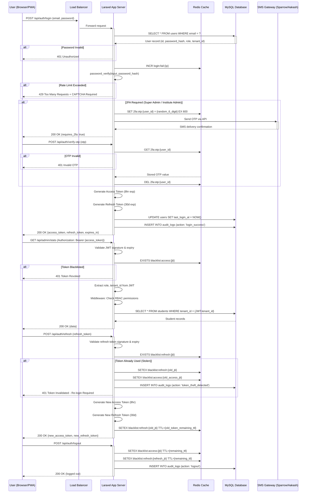
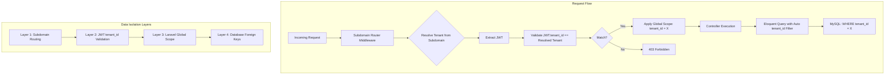

# Authentication & Authorization — PRD & SRS
## HamroLabs Academic ERP v3.0

**Document Version:** 1.0  
**Last Updated:** March 10, 2026  
**Classification:** Internal - Technical Documentation  
**Project:** Multi-Tenant Academic ERP System for Nepal

---

## Table of Contents

1. [PRD — Product Requirements Document](#prd)
   - [1.1 Overview & Goals](#11-overview--goals)
   - [1.2 User Personas](#12-user-personas)
   - [1.3 User Stories](#13-user-stories)
   - [1.4 Feature List](#14-feature-list)
   - [1.5 Out of Scope](#15-out-of-scope)

2. [SRS — Software Requirements Specification](#srs)
   - [2.1 Functional Requirements](#21-functional-requirements)
   - [2.2 Non-Functional Requirements](#22-non-functional-requirements)
   - [2.3 System Architecture](#23-system-architecture)
   - [2.4 Data Models](#24-data-models)
   - [2.5 API Endpoints](#25-api-endpoints)
   - [2.6 Security Requirements](#26-security-requirements)
   - [2.7 Error Handling](#27-error-handling)
   - [2.8 Dependencies](#28-dependencies)

---

<a name="prd"></a>
## 1. PRD — Product Requirements Document

<a name="11-overview--goals"></a>
### 1.1 Overview & Goals

**What is it?**  
HamroLabs Academic ERP implements a comprehensive **JWT-based stateless authentication and RBAC (Role-Based Access Control) authorization system** designed specifically for a multi-tenant SaaS environment serving educational institutes across Nepal.

**Purpose:**  
- Provide secure, scalable authentication for 6 distinct user roles across multiple tenant organizations
- Enforce strict data isolation between tenants while maintaining a shared infrastructure
- Support Nepali-specific requirements including SMS-based OTP 2FA and local gateway integration
- Enable horizontal scaling through stateless session management
- Comply with enterprise security requirements for educational data protection

**Business Goals:**  
- **Security:** Zero cross-tenant data leakage, industry-standard password hashing, comprehensive audit logging
- **Compliance:** Full audit trail for Super Admin impersonation, immutable access logs, PII encryption at rest
- **Scalability:** Stateless design supporting 1,000+ tenant institutes with 50,000+ concurrent users
- **User Experience:** Single-page login for all 6 roles, PWA-ready mobile authentication, sub-3-second response times on 3G
- **Market Differentiation:** Nepal-specific 2FA via Sparrow SMS/Aakash SMS, BS/AD calendar support, Loksewa-focused workflows

<a name="12-user-personas"></a>
### 1.2 User Personas

The system supports **6 distinct user roles** with hierarchical permissions and isolated data access:

#### **Persona 1: Super Admin (Platform Owner)**
- **Organization:** Hamro Labs Pvt. Ltd. (Platform operator)
- **Access Scope:** Platform-wide, all tenants
- **Technical Profile:** High technical literacy, uses admin panel daily
- **Security Requirements:** Mandatory 2FA, all actions logged with reason

#### **Persona 2: Institute Admin**
- **Organization:** Individual educational institute (tenant)
- **Access Scope:** Full access to own tenant data
- **Technical Profile:** Moderate technical literacy, primary system administrator
- **Security Requirements:** Mandatory 2FA, manages all institute operations

#### **Persona 3: Front Desk Operator**
- **Organization:** Individual educational institute (tenant)
- **Access Scope:** Student admissions, fee collection (no salary/financial reports access)
- **Technical Profile:** Basic computer literacy, data entry focused
- **Security Requirements:** Password + Optional OTP (configurable per institute)

#### **Persona 4: Teacher**
- **Organization:** Individual educational institute (tenant)
- **Access Scope:** Only assigned batches and subjects
- **Technical Profile:** Mobile-first user, primarily uses PWA
- **Security Requirements:** Password authentication

#### **Persona 5: Student**
- **Organization:** Individual educational institute (tenant)
- **Access Scope:** Own academic records only (read-only for most data)
- **Technical Profile:** Mobile-first, moderate digital literacy
- **Security Requirements:** Password authentication, auto-generated credentials

#### **Persona 6: Guardian**
- **Organization:** Individual educational institute (tenant)
- **Access Scope:** Read-only access to linked child's data
- **Technical Profile:** Low to moderate digital literacy, mobile-first
- **Security Requirements:** Password authentication, independent from student login

<a name="13-user-stories"></a>
### 1.3 User Stories

#### **Super Admin User Stories:**
- As a **Super Admin**, I want to **log in with email and 2FA OTP** so that **platform access is secured against credential theft**
- As a **Super Admin**, I want to **impersonate any Institute Admin** so that **I can provide technical support while maintaining a full audit trail**
- As a **Super Admin**, I want to **view all authentication logs across all tenants** so that **I can detect security incidents platform-wide**
- As a **Super Admin**, I want to **suspend a tenant account immediately** so that **non-paying or policy-violating institutes are blocked from system access**
- As a **Super Admin**, I want to **rotate my JWT refresh token on every use** so that **stolen tokens become invalid after legitimate use**

#### **Institute Admin User Stories:**
- As an **Institute Admin**, I want to **log in with mandatory 2FA** so that **my institute's sensitive data is protected**
- As an **Institute Admin**, I want to **create Front Desk, Teacher, Student, and Guardian accounts** so that **my staff and students can access the system**
- As an **Institute Admin**, I want to **receive audit logs of all admin actions** so that **I can track who modified critical data**
- As an **Institute Admin**, I want to **auto-generate student login credentials on admission** so that **students can immediately access the portal**
- As an **Institute Admin**, I want to **lock user accounts after 5 failed login attempts** so that **brute force attacks are prevented**

#### **Front Desk Operator User Stories:**
- As a **Front Desk Operator**, I want to **log in with email and password** so that **I can access student admission and fee modules**
- As a **Front Desk Operator**, I want to **optionally use OTP 2FA if enabled by my institute** so that **my login is more secure**
- As a **Front Desk Operator**, I want to **NOT see teacher salary or financial reports** so that **sensitive data is restricted**
- As a **Front Desk Operator**, I want to **view only students from my tenant** so that **data isolation is maintained**

#### **Teacher User Stories:**
- As a **Teacher**, I want to **log in from my mobile phone** so that **I can mark attendance in the classroom**
- As a **Teacher**, I want to **see only the batches assigned to me** so that **I don't have access to unrelated student data**
- As a **Teacher**, I want to **stay logged in for 8 hours** so that **I don't need to re-authenticate during my teaching day**
- As a **Teacher**, I want to **refresh my token seamlessly** so that **I'm not interrupted mid-session**

#### **Student User Stories:**
- As a **Student**, I want to **receive auto-generated login credentials via SMS** so that **I can access my portal immediately after admission**
- As a **Student**, I want to **log in and view my timetable, fees, and exam results** so that **I stay updated on my academic progress**
- As a **Student**, I want to **be redirected to my student dashboard after login** so that **I don't see other role interfaces**
- As a **Student**, I want to **NOT be able to access data from other students** so that **my privacy is protected**

#### **Guardian User Stories:**
- As a **Guardian**, I want to **log in independently from my child** so that **I can monitor progress without sharing their password**
- As a **Guardian**, I want to **view only my linked child's attendance and exam data** so that **I have read-only transparency**
- As a **Guardian**, I want to **receive notifications if my child is marked absent** so that **I'm informed in real-time**

<a name="14-feature-list"></a>
### 1.4 Feature List

#### **Authentication Features:**
- ✅ **Multi-Role Login System:** Single login page auto-detects role from user record
- ✅ **JWT Authentication:** 8-hour access token + 30-day rotating refresh token
- ✅ **Two-Factor Authentication (2FA/MFA):**
  - Mandatory for Super Admin and Institute Admin
  - Optional for Front Desk (configurable per tenant)
  - SMS OTP via Sparrow SMS (primary) + Aakash SMS (failover)
  - 6-digit numeric OTP, valid 10 minutes, single-use
- ✅ **Session Management:** Stateless JWT design, Redis-backed for token blacklisting
- ✅ **Refresh Token Rotation:** New refresh token issued on every use, old token invalidated
- ✅ **Auto-Logout:** All tokens invalidated immediately on manual logout
- ✅ **Remember Me:** Extended refresh token lifetime (configurable, default 30 days)

#### **Authorization Features:**
- ✅ **Role-Based Access Control (RBAC):** 6 distinct roles with granular permissions
- ✅ **Middleware-Enforced Permissions:** Role and permission checks before controller execution
- ✅ **Tenant Data Isolation:** Laravel Global Scope auto-applies `WHERE tenant_id = ?` to all queries
- ✅ **Feature Plan Gating:** Middleware checks JWT plan_id against feature matrix (Starter/Growth/Professional/Enterprise)
- ✅ **Batch-Level Scoping for Teachers:** Teachers only access assigned batches
- ✅ **Guardian-Child Linkage:** Guardians only access linked child data (read-only)

#### **Security Features:**
- ✅ **Rate Limiting:** Max 5 failed login attempts per IP per 15-minute window
- ✅ **CAPTCHA Challenge:** Triggered after 5 failed login attempts
- ✅ **Account Locking:** Configurable lockout duration (default: `locked_until` timestamp)
- ✅ **Password Hashing:** bcrypt with cost factor 12 minimum
- ✅ **Audit Logging:** All authentication events logged (`audit_logs` table) with IP, user agent, timestamp
- ✅ **Token Blacklisting:** Redis-based revoked token list for immediate logout enforcement
- ✅ **HTTPS Enforcement:** TLS 1.3 minimum, Cloudflare edge termination
- ✅ **SQL Injection Prevention:** Laravel Eloquent ORM with parameterized queries
- ✅ **XSS Prevention:** Server-side input sanitization + Content Security Policy headers

#### **User Management Features:**
- ✅ **Auto-Generated Credentials:** Students receive login via SMS/email on admission
- ✅ **Manual User Creation:** Institute Admin creates Teacher, Front Desk, Guardian accounts
- ✅ **User Status Management:** active/inactive/suspended status per user
- ✅ **Soft Delete Support:** `deleted_at` timestamp for user recovery
- ✅ **Last Login Tracking:** `last_login_at` timestamp for security monitoring
- ✅ **Super Admin Impersonation:** Full audit trail with reason, start/end time, actions taken

#### **Advanced Features:**
- ✅ **Multi-Tenant Architecture:** Shared database with `tenant_id` foreign key isolation
- ✅ **API Key Authentication:** Separate `api_keys` table for third-party integrations
- ✅ **API Request Logging:** All API calls logged to `api_logs` table
- ✅ **Cross-Origin Resource Sharing (CORS):** Configured for PWA mobile app
- ✅ **Subdomain-Based Routing:** Each tenant has unique subdomain for branding

<a name="15-out-of-scope"></a>
### 1.5 Out of Scope

The following features are **NOT implemented** in the current authentication system:

- ❌ **OAuth / Social Login:** No Google, Facebook, or third-party identity providers
- ❌ **Email Verification on Signup:** Students/users created by admin, no self-registration
- ❌ **Password Reset via Email Link:** All password resets handled by Institute Admin manually
- ❌ **Biometric Authentication:** No fingerprint, Face ID, or hardware token support
- ❌ **SAML / Single Sign-On (SSO):** No enterprise SSO federation
- ❌ **TOTP-Based 2FA:** Only SMS OTP, no Google Authenticator / Authy support
- ❌ **Magic Link Login:** No passwordless email authentication
- ❌ **Multi-Device Session Management:** No "view active sessions" or "logout from all devices"
- ❌ **Password Strength Meter:** No client-side password complexity enforcement UI
- ❌ **Account Recovery Questions:** No security questions for account recovery
- ❌ **IP Whitelisting:** No network-level access restrictions (future enterprise feature)
- ❌ **Device Fingerprinting:** No browser/device trust scoring
- ❌ **Geo-Blocking:** No country-level access restrictions

---

<a name="srs"></a>
## 2. SRS — Software Requirements Specification

<a name="21-functional-requirements"></a>
### 2.1 Functional Requirements

#### **FR-AUTH-001: Multi-Role Login**
**Priority:** CRITICAL  
**Description:** The system SHALL provide a single login endpoint that serves all 6 user roles. Role detection SHALL occur post-authentication based on the `role` field in the `users` table.

**Acceptance Criteria:**
- User enters email and password on a unified login form
- System validates credentials against `users.email` and `users.password_hash`
- On successful authentication, system reads `users.role` enum value
- System issues JWT with role embedded in payload
- System redirects user to role-specific dashboard URL:
  - `superadmin` → `/super-admin/dashboard`
  - `instituteadmin` → `/admin/dashboard`
  - `frontdesk` → `/front-desk/dashboard`
  - `teacher` → `/teacher/dashboard`
  - `student` → `/student/dashboard`
  - `guardian` → `/guardian/dashboard`

**Error Conditions:**
- Invalid email/password: Return HTTP 401 with message "Invalid credentials"
- Account suspended: Return HTTP 403 with message "Account suspended"
- Account locked: Return HTTP 429 with `locked_until` timestamp

---

#### **FR-AUTH-002: JWT Token Issuance**
**Priority:** CRITICAL  
**Description:** The system SHALL issue two JWT tokens on successful login: an 8-hour access token and a 30-day refresh token.

**Acceptance Criteria:**
- Access token contains: `user_id`, `tenant_id`, `role`, `plan_id`, `exp` (8 hours from issue time)
- Refresh token contains: `user_id`, `jti` (unique token ID), `exp` (30 days from issue time)
- Both tokens signed using `tymon/jwt-auth` library with HS256 algorithm
- Tokens returned in JSON response: `{ "access_token": "...", "refresh_token": "...", "expires_in": 28800 }`
- System updates `users.last_login_at` timestamp to `NOW()`

**Technical Spec:**
```php
// Example JWT payload (access token)
{
  "iss": "hamrolabs.com.np",
  "sub": 38,                    // user_id
  "tenant_id": 5,
  "role": "instituteadmin",
  "plan_id": "growth",
  "iat": 1709870400,
  "exp": 1709899200            // 8 hours later
}
```

---

#### **FR-AUTH-003: Two-Factor Authentication (2FA)**
**Priority:** HIGH  
**Description:** The system SHALL enforce mandatory SMS OTP 2FA for Super Admin and Institute Admin roles. Front Desk 2FA SHALL be configurable per tenant.

**Acceptance Criteria:**
- After successful password validation for `superadmin` or `instituteadmin`, system generates 6-digit random OTP
- OTP stored in Redis with key `2fa:otp:{user_id}` and TTL 600 seconds (10 minutes)
- OTP sent via Sparrow SMS API (primary) or Aakash SMS API (failover)
- User must submit OTP within 10 minutes
- On valid OTP, system issues JWT tokens per FR-AUTH-002
- On invalid OTP, increment failure counter; after 3 failures, regenerate new OTP

**SMS Message Template:**
```
Your HamroLabs login OTP is: {OTP}. Valid for 10 minutes. Do not share this code.
```

**Redis Data Structure:**
```
Key: 2fa:otp:38
Value: {"otp": "742831", "attempts": 0, "generated_at": 1709870400}
TTL: 600 seconds
```

---

#### **FR-AUTH-004: Refresh Token Rotation**
**Priority:** HIGH  
**Description:** The system SHALL rotate refresh tokens on every use. When a refresh token is used to obtain a new access token, the old refresh token SHALL be invalidated and a new refresh token SHALL be issued.

**Acceptance Criteria:**
- Endpoint: `POST /api/auth/refresh` with `refresh_token` in request body
- System validates refresh token signature and expiry
- System checks if token is blacklisted in Redis (`blacklist:refresh:{jti}`)
- If valid, system issues new access token (8 hours) + new refresh token (30 days)
- Old refresh token added to Redis blacklist with TTL matching original expiry
- If stolen token is used after legitimate rotation, both tokens invalidated

**Attack Scenario Protection:**
1. Legitimate user refreshes token at T0 → receives Token_A_new
2. Attacker uses stolen Token_A at T1 → system detects Token_A is blacklisted
3. System invalidates Token_A_new and alerts user via email/SMS

---

#### **FR-AUTH-005: Rate Limiting and Account Locking**
**Priority:** HIGH  
**Description:** The system SHALL limit failed login attempts to 5 per IP address per 15-minute window. After 5 failures, CAPTCHA challenge SHALL be required.

**Acceptance Criteria:**
- Failed login increments Redis counter: `login:fail:{ip}` with TTL 900 seconds
- After 5 failures, system requires CAPTCHA verification (Google reCAPTCHA v3)
- After 10 failures from same IP, system locks account by setting `users.locked_until = NOW() + INTERVAL 1 HOUR`
- All failed login attempts logged to `audit_logs` table with IP address and user agent

**Redis Implementation:**
```
Key: login:fail:103.244.178.23
Value: 3
TTL: 900 seconds
```

---

#### **FR-AUTH-006: Role-Based Access Control (RBAC)**
**Priority:** CRITICAL  
**Description:** The system SHALL enforce permissions at the middleware layer. Role SHALL be extracted from JWT payload and permission matrix SHALL be checked before controller execution.

**Acceptance Criteria:**
- Middleware `RoleMiddleware` checks `JWT.role` against allowed roles for route
- Middleware `TenantMiddleware` validates `JWT.tenant_id` matches resource tenant (except Super Admin)
- Middleware `FeatureGateMiddleware` checks `JWT.plan_id` against feature flag matrix
- Unauthorized access returns HTTP 403 with JSON: `{ "error": "Forbidden", "message": "Insufficient permissions" }`

**Permission Matrix Example:**
| Route | Super Admin | Institute Admin | Front Desk | Teacher | Student | Guardian |
|-------|-------------|-----------------|------------|---------|---------|----------|
| `/admin/students` | ✅ | ✅ | ✅ | ❌ | ❌ | ❌ |
| `/admin/teachers` | ✅ | ✅ | ❌ | ❌ | ❌ | ❌ |
| `/teacher/attendance` | ✅ | ✅ | ❌ | ✅ | ❌ | ❌ |
| `/student/timetable` | ✅ | ✅ | ❌ | ❌ | ✅ | ❌ |
| `/guardian/child/summary` | ✅ | ✅ | ❌ | ❌ | ❌ | ✅ |

---

#### **FR-AUTH-007: Tenant Data Isolation**
**Priority:** CRITICAL  
**Description:** The system SHALL automatically scope all database queries to the current tenant using Laravel Global Scope. Cross-tenant data access SHALL be architecturally impossible.

**Acceptance Criteria:**
- All Eloquent models extend base `TenantScoped` model
- Global scope applies `WHERE tenant_id = {JWT.tenant_id}` to all SELECT/UPDATE/DELETE queries
- INSERT queries auto-populate `tenant_id` from JWT
- Super Admin (tenant_id = NULL) bypasses global scope for platform-wide access
- Middleware validates tenant_id in JWT matches requested resource tenant

**Laravel Implementation:**
```php
// app/Models/TenantScoped.php
protected static function booted() {
    static::addGlobalScope('tenant', function (Builder $builder) {
        if (Auth::check() && Auth::user()->tenant_id !== null) {
            $builder->where('tenant_id', Auth::user()->tenant_id);
        }
    });
}
```

---

#### **FR-AUTH-008: Audit Logging**
**Priority:** HIGH  
**Description:** The system SHALL log all authentication events to the `audit_logs` table. Logs SHALL be immutable.

**Acceptance Criteria:**
- Events logged: login success, login failure, logout, token refresh, 2FA success/failure, password change, account locked
- Each log entry contains: `user_id`, `tenant_id`, `action`, `ip_address`, `user_agent`, `timestamp`, `metadata` (JSON)
- Logs SHALL NOT be deletable by any user (no DELETE endpoint exposed)
- Super Admin impersonation logged with additional fields: `impersonated_user_id`, `reason`, `session_start`, `session_end`

**Database Schema:**
```sql
CREATE TABLE audit_logs (
  id BIGINT UNSIGNED AUTO_INCREMENT PRIMARY KEY,
  user_id BIGINT UNSIGNED,
  tenant_id BIGINT UNSIGNED,
  action VARCHAR(100) NOT NULL,
  ip_address VARCHAR(45),
  user_agent TEXT,
  metadata JSON,
  created_at TIMESTAMP DEFAULT CURRENT_TIMESTAMP,
  INDEX idx_user (user_id),
  INDEX idx_tenant (tenant_id),
  INDEX idx_action (action)
);
```

---

#### **FR-AUTH-009: Logout and Token Invalidation**
**Priority:** MEDIUM  
**Description:** The system SHALL immediately invalidate both access and refresh tokens on logout.

**Acceptance Criteria:**
- Endpoint: `POST /api/auth/logout` with `access_token` in Authorization header
- System extracts `jti` from access token and adds to Redis blacklist: `blacklist:access:{jti}` with TTL = remaining token lifetime
- System extracts user_id, retrieves associated refresh token, and blacklists: `blacklist:refresh:{refresh_jti}`
- System logs logout event to `audit_logs`
- Future requests with blacklisted tokens return HTTP 401

---

#### **FR-AUTH-010: Auto-Generated Student Credentials**
**Priority:** MEDIUM  
**Description:** The system SHALL auto-generate login credentials for students on admission and send via SMS/email.

**Acceptance Criteria:**
- On student admission, system generates:
  - Email: `{first_name}.{last_name}{random_4_digit}@studentportal.tenant.hamrolabs.com.np`
  - Password: Random 12-character alphanumeric string
- Password hashed with bcrypt (cost factor 12) before storage
- Welcome SMS sent: "Welcome to {institute_name}. Your login: {email}, Password: {plain_password}. Change password after first login."
- Welcome email sent with same credentials
- Plain password NOT stored anywhere after SMS/email sent

---

<a name="22-non-functional-requirements"></a>
### 2.2 Non-Functional Requirements

#### **NFR-AUTH-001: Password Security**
**Priority:** CRITICAL  
The system SHALL hash all passwords using **bcrypt** with a minimum cost factor of **12**.

**Rationale:** bcrypt is adaptive and resistant to rainbow table attacks. Cost factor 12 provides ~250ms hash time, balancing security and UX.

**Implementation:** PHP `password_hash($password, PASSWORD_BCRYPT, ['cost' => 12])`

---

#### **NFR-AUTH-002: Token Expiry**
**Priority:** HIGH  
- Access tokens SHALL expire after **8 hours**
- Refresh tokens SHALL expire after **30 days**
- OTP codes SHALL expire after **10 minutes**

**Rationale:** Shorter access token window limits damage from token theft. 30-day refresh allows "remember me" UX without compromising security.

---

#### **NFR-AUTH-003: Performance**
**Priority:** HIGH  
- Login endpoint SHALL respond within **800ms** on 3G network (99th percentile)
- Token refresh SHALL respond within **200ms** (99th percentile)
- JWT validation middleware overhead SHALL NOT exceed **50ms** per request

**Testing Criteria:**
- Load test with 1,000 concurrent login attempts
- Token validation must handle 10,000 requests/second on single server instance

---

#### **NFR-AUTH-004: Scalability**
**Priority:** HIGH  
The authentication system SHALL support:
- **1,000+ tenant institutes**
- **50,000+ concurrent authenticated users**
- **100,000+ daily login attempts**

**Design Decisions:**
- Stateless JWT design eliminates session storage bottleneck
- Redis for OTP/rate limiting/blacklisting (horizontal scaling via Redis Cluster)
- Database connection pooling (min 50, max 200 connections)

---

#### **NFR-AUTH-005: Availability**
**Priority:** MEDIUM  
- Authentication service uptime: **99.7%** (Professional plan), **99.9%** (Enterprise plan)
- Failover SMS gateway: If Sparrow SMS fails, auto-retry with Aakash SMS within **5 seconds**

---

#### **NFR-AUTH-006: Security Standards**
**Priority:** CRITICAL  
- All authentication traffic SHALL use **HTTPS with TLS 1.3** minimum
- JWT secrets SHALL be **256-bit random keys** rotated every **90 days**
- Rate limiting SHALL prevent **DDoS attacks** targeting login endpoint
- CAPTCHA SHALL prevent **automated credential stuffing**

---

<a name="23-system-architecture"></a>
### 2.3 System Architecture

#### **Authentication Flow Architecture**

The system implements a **stateless JWT-based authentication** architecture with the following components:

**Technology Stack:**
- **Backend Framework:** Laravel 11 (PHP 8.2)
- **JWT Library:** tymon/jwt-auth v2.1 (lcobucci/jwt v4.0.4)
- **Session Store:** Redis 7.x (for OTP, rate limiting, token blacklist)
- **Database:** MySQL 8.0 / MariaDB 12.0
- **SMS Gateways:** Sparrow SMS (primary), Aakash SMS (failover)
- **CAPTCHA:** Google reCAPTCHA v3

**Architecture Diagram:**



---

#### **Multi-Tenant Isolation Architecture**



**Isolation Guarantees:**
1. **Subdomain Level:** `tenant5.hamrolabs.com.np` → resolves `tenant_id = 5`
2. **JWT Level:** JWT payload MUST contain matching `tenant_id`
3. **ORM Level:** Laravel Global Scope applies `WHERE tenant_id = 5` to ALL queries
4. **Database Level:** Foreign key constraints enforce referential integrity

**Exception:** Super Admin (tenant_id = NULL) bypasses all tenant scoping for platform-wide access.

---

<a name="24-data-models"></a>
### 2.4 Data Models

#### **Table: `users` (Central Authentication Table)**

```sql
CREATE TABLE `users` (
  `id` BIGINT(20) UNSIGNED NOT NULL AUTO_INCREMENT,
  `tenant_id` BIGINT(20) UNSIGNED DEFAULT NULL COMMENT 'NULL for Super Admin',
  `role` ENUM('superadmin','instituteadmin','teacher','student','guardian','frontdesk') NOT NULL,
  `email` VARCHAR(255) NOT NULL,
  `password_hash` VARCHAR(255) NOT NULL COMMENT 'bcrypt, cost factor 12',
  `phone` VARCHAR(20) DEFAULT NULL COMMENT 'For 2FA OTP',
  `status` ENUM('active','inactive','suspended') NOT NULL DEFAULT 'active',
  `last_login_at` TIMESTAMP NULL DEFAULT NULL,
  `two_fa_enabled` TINYINT(1) NOT NULL DEFAULT 0,
  `two_factor_enabled` TINYINT(1) DEFAULT 0 COMMENT 'Duplicate field - consolidate',
  `two_factor_secret` VARCHAR(255) DEFAULT NULL COMMENT 'Reserved for TOTP (not implemented)',
  `locked_until` TIMESTAMP NULL DEFAULT NULL COMMENT 'Account lock expiry',
  `avatar` VARCHAR(500) DEFAULT NULL,
  `name` VARCHAR(255) DEFAULT NULL,
  `monthly_salary` DECIMAL(10,2) DEFAULT 0.00,
  `created_at` TIMESTAMP NOT NULL DEFAULT CURRENT_TIMESTAMP,
  `updated_at` TIMESTAMP NOT NULL DEFAULT CURRENT_TIMESTAMP ON UPDATE CURRENT_TIMESTAMP,
  `deleted_at` TIMESTAMP NULL DEFAULT NULL COMMENT 'Soft delete',
  PRIMARY KEY (`id`),
  KEY `fk_users_tenant` (`tenant_id`),
  UNIQUE KEY `unique_email_per_tenant` (`tenant_id`, `email`),
  CONSTRAINT `fk_users_tenant` FOREIGN KEY (`tenant_id`) REFERENCES `tenants` (`id`) ON DELETE CASCADE
) ENGINE=InnoDB DEFAULT CHARSET=utf8mb4 COLLATE=utf8mb4_unicode_ci;
```

**Field Notes:**
- `role`: Single enum controls dashboard routing and permissions
- `tenant_id`: NULL only for Super Admin; all others scoped to tenant
- `password_hash`: Format `$2y$12$...` (bcrypt)
- `two_fa_enabled` vs `two_factor_enabled`: Duplicate columns (code smell - needs consolidation)
- `locked_until`: If `NOW() < locked_until`, account is locked

---

#### **Table: `tenants` (Institute Master Record)**

```sql
CREATE TABLE `tenants` (
  `id` BIGINT(20) UNSIGNED NOT NULL AUTO_INCREMENT,
  `name` VARCHAR(255) NOT NULL,
  `nepali_name` VARCHAR(255) DEFAULT NULL,
  `subdomain` VARCHAR(255) NOT NULL UNIQUE COMMENT 'URL routing key',
  `brand_color` VARCHAR(20) DEFAULT NULL,
  `tagline` VARCHAR(500) DEFAULT NULL,
  `logo_path` VARCHAR(500) DEFAULT NULL,
  `phone` VARCHAR(20) DEFAULT NULL,
  `email` VARCHAR(255) DEFAULT NULL,
  `website` VARCHAR(255) DEFAULT NULL,
  `address` TEXT DEFAULT NULL,
  `province` VARCHAR(100) DEFAULT NULL,
  `pan_no` VARCHAR(100) DEFAULT NULL,
  `plan` ENUM('starter','growth','professional','enterprise') NOT NULL DEFAULT 'starter',
  `status` ENUM('active','suspended','trial') NOT NULL DEFAULT 'trial',
  `student_limit` INT(10) UNSIGNED NOT NULL DEFAULT 100,
  `sms_credits` INT(10) UNSIGNED NOT NULL DEFAULT 500,
  `trial_ends_at` TIMESTAMP NULL DEFAULT NULL,
  `created_at` TIMESTAMP NOT NULL DEFAULT CURRENT_TIMESTAMP,
  `updated_at` TIMESTAMP NOT NULL DEFAULT CURRENT_TIMESTAMP ON UPDATE CURRENT_TIMESTAMP,
  `deleted_at` TIMESTAMP NULL DEFAULT NULL,
  `settings` LONGTEXT CHARACTER SET utf8mb4 COLLATE utf8mb4_bin DEFAULT NULL CHECK (JSON_VALID(`settings`)),
  PRIMARY KEY (`id`),
  UNIQUE KEY `idx_tenants_subdomain` (`subdomain`)
) ENGINE=InnoDB DEFAULT CHARSET=utf8mb4 COLLATE=utf8mb4_unicode_ci;
```

**Field Notes:**
- `subdomain`: Used for routing (e.g., `brightfuture.hamrolabs.com.np`)
- `plan`: Controls feature access via middleware
- `status`: `suspended` blocks all users from login
- `student_limit`: Hard cap enforced at admission
- `sms_credits`: Decremented on each SMS sent

---

#### **Table: `api_keys` (Third-Party API Authentication)**

```sql
CREATE TABLE `api_keys` (
  `id` BIGINT(20) UNSIGNED NOT NULL AUTO_INCREMENT,
  `tenant_id` BIGINT(20) UNSIGNED NOT NULL,
  `key_name` VARCHAR(100) NOT NULL,
  `api_key` VARCHAR(100) NOT NULL UNIQUE COMMENT 'Public key',
  `api_secret` VARCHAR(255) NOT NULL COMMENT 'Hashed secret',
  `permissions` LONGTEXT CHARACTER SET utf8mb4 COLLATE utf8mb4_bin DEFAULT NULL CHECK (JSON_VALID(`permissions`)),
  `is_active` TINYINT(1) NOT NULL DEFAULT 1,
  `last_used_at` TIMESTAMP NULL DEFAULT NULL,
  `expires_at` TIMESTAMP NULL DEFAULT NULL,
  `created_at` TIMESTAMP NOT NULL DEFAULT CURRENT_TIMESTAMP,
  PRIMARY KEY (`id`),
  UNIQUE KEY `api_key` (`api_key`),
  KEY `idx_apikey_tenant` (`tenant_id`),
  KEY `idx_apikey_key` (`api_key`)
) ENGINE=InnoDB DEFAULT CHARSET=utf8mb4 COLLATE=utf8mb4_unicode_ci;
```

**Usage:** Separate authentication flow for third-party integrations (e.g., payment gateways, mobile apps).

---

#### **Table: `audit_logs` (Immutable Security Log)**

```sql
CREATE TABLE `audit_logs` (
  `id` BIGINT(20) UNSIGNED NOT NULL AUTO_INCREMENT,
  `user_id` BIGINT(20) UNSIGNED DEFAULT NULL,
  `tenant_id` BIGINT(20) UNSIGNED DEFAULT NULL,
  `action` VARCHAR(100) NOT NULL COMMENT 'e.g., login_success, login_failed, logout',
  `table_name` VARCHAR(100) DEFAULT NULL,
  `record_id` BIGINT(20) UNSIGNED DEFAULT NULL,
  `ip_address` VARCHAR(45) DEFAULT NULL,
  `user_agent` TEXT DEFAULT NULL,
  `metadata` JSON DEFAULT NULL COMMENT 'Old vs new values, reason, etc.',
  `created_at` TIMESTAMP NOT NULL DEFAULT CURRENT_TIMESTAMP,
  PRIMARY KEY (`id`),
  KEY `idx_audit_user` (`user_id`),
  KEY `idx_audit_tenant` (`tenant_id`),
  KEY `idx_audit_action` (`action`),
  KEY `idx_audit_created` (`created_at`)
) ENGINE=InnoDB DEFAULT CHARSET=utf8mb4 COLLATE=utf8mb4_unicode_ci;
```

**Logged Events:**
- `login_success`, `login_failed`, `logout`
- `2fa_sent`, `2fa_success`, `2fa_failed`
- `token_refreshed`, `token_revoked`
- `account_locked`, `account_unlocked`
- `password_changed`, `user_created`, `user_deleted`

**Immutability:** No DELETE endpoint; retention policy managed at database backup level.

---

<a name="25-api-endpoints"></a>
### 2.5 API Endpoints

#### **Public Endpoints (No Authentication Required)**

| Method | Endpoint | Description | Request Body | Response |
|--------|----------|-------------|--------------|----------|
| POST | `/api/auth/login` | Authenticate user, issue JWT | `{ "email": "...", "password": "..." }` | `{ "access_token": "...", "refresh_token": "...", "expires_in": 28800, "requires_2fa": false }` |
| POST | `/api/auth/verify-otp` | Verify 2FA OTP code | `{ "email": "...", "otp": "123456" }` | `{ "access_token": "...", "refresh_token": "..." }` |

---

#### **Protected Endpoints (Require JWT Authentication)**

| Method | Endpoint | Middleware | Description | Request | Response |
|--------|----------|------------|-------------|---------|----------|
| POST | `/api/auth/refresh` | `none` | Refresh access token | `{ "refresh_token": "..." }` | `{ "access_token": "...", "refresh_token": "..." }` |
| POST | `/api/auth/logout` | `auth` | Invalidate tokens, logout | Bearer token in header | `{ "message": "Logged out successfully" }` |
| GET | `/api/auth/me` | `auth` | Get current user profile | - | `{ "id": 38, "name": "...", "role": "instituteadmin", "tenant": {...} }` |

---

#### **Role-Specific Dashboard Endpoints**

| Method | Endpoint | Middleware | Roles Allowed | Description |
|--------|----------|------------|---------------|-------------|
| GET | `/api/admin/stats` | `auth, role:instituteadmin, tenant.active` | Institute Admin | Dashboard KPIs |
| GET | `/api/teacher/dashboard` | `auth, role:teacher, tenant.active` | Teacher | Teacher dashboard data |
| GET | `/api/student/dashboard` | `auth, role:student, tenant.active` | Student | Student dashboard data |
| GET | `/api/guardian/child/summary` | `auth, role:guardian, tenant.active` | Guardian | Child's summary data |

---

#### **API Response Formats**

**Success Response (200 OK):**
```json
{
  "success": true,
  "data": {
    "access_token": "eyJ0eXAiOiJKV1QiLCJhbGc...",
    "refresh_token": "eyJ0eXAiOiJKV1QiLCJhbGc...",
    "expires_in": 28800,
    "user": {
      "id": 38,
      "email": "admin@example.com",
      "role": "instituteadmin",
      "tenant_id": 5
    }
  }
}
```

**Error Response (401 Unauthorized):**
```json
{
  "success": false,
  "error": "Unauthorized",
  "message": "Invalid credentials",
  "code": "AUTH_INVALID_CREDENTIALS"
}
```

**Error Response (429 Too Many Requests):**
```json
{
  "success": false,
  "error": "TooManyRequests",
  "message": "Too many login attempts. Please complete CAPTCHA.",
  "retry_after": 900,
  "requires_captcha": true
}
```

---

<a name="26-security-requirements"></a>
### 2.6 Security Requirements

#### **SEC-001: Transport Layer Security**
- **Requirement:** ALL API traffic SHALL use HTTPS with TLS 1.3 minimum
- **Implementation:** Cloudflare edge termination + nginx HTTPS redirect
- **Testing:** SSL Labs A+ rating mandatory

---

#### **SEC-002: Password Storage**
- **Requirement:** Passwords SHALL be hashed using bcrypt with cost factor ≥ 12
- **Implementation:** `password_hash($input, PASSWORD_BCRYPT, ['cost' => 12])`
- **Verification:** `password_verify($input, $stored_hash)`
- **Never logged:** Passwords MUST NOT appear in logs, error messages, or database plaintext

---

#### **SEC-003: JWT Secret Management**
- **Requirement:** JWT signing keys SHALL be 256-bit random strings
- **Storage:** Environment variable `JWT_SECRET` in `.env` (never committed to Git)
- **Rotation:** Secrets rotated every 90 days; old tokens gradually expire

---

#### **SEC-004: SQL Injection Prevention**
- **Requirement:** ALL database queries SHALL use parameterized queries
- **Implementation:** Laravel Eloquent ORM exclusively; raw SQL queries prohibited
- **Example:**
  ```php
  // CORRECT
  User::where('email', $email)->first();
  
  // PROHIBITED
  DB::raw("SELECT * FROM users WHERE email = '$email'");
  ```

---

#### **SEC-005: XSS Prevention**
- **Requirement:** All user inputs SHALL be sanitized server-side
- **Implementation:** Laravel Blade automatic escaping `{{ $variable }}`
- **Headers:** Content-Security-Policy with `script-src 'self'`

---

#### **SEC-006: CSRF Protection**
- **Requirement:** All state-changing requests SHALL include CSRF token
- **Implementation:** Laravel `@csrf` directive in forms; `X-CSRF-TOKEN` header for API
- **Exception:** Stateless JWT API endpoints exempt from CSRF

---

#### **SEC-007: Rate Limiting**
- **Requirement:** Login endpoint SHALL enforce 5 attempts per IP per 15 minutes
- **Implementation:** Redis counter with TTL
- **Response:** HTTP 429 with `Retry-After` header

---

#### **SEC-008: Account Lockout**
- **Requirement:** After 10 failed attempts, account locked for 1 hour
- **Implementation:** `users.locked_until = NOW() + INTERVAL 1 HOUR`
- **Unlock:** Automatic after expiry OR manual by Institute Admin

---

#### **SEC-009: Token Blacklisting**
- **Requirement:** Revoked tokens SHALL be blacklisted immediately
- **Implementation:** Redis keys `blacklist:access:{jti}` and `blacklist:refresh:{jti}`
- **TTL:** Matches remaining token lifetime
- **Performance:** Redis GET latency < 5ms

---

#### **SEC-010: PII Encryption at Rest**
- **Requirement:** Student citizenship_no, national_id, address encrypted with AES-256
- **Implementation:** Laravel encrypted casts: `protected $casts = ['citizenship_no' => 'encrypted'];`
- **Key Management:** Encryption key in `.env` (`APP_KEY`), rotated quarterly

---

#### **SEC-011: Audit Trail Completeness**
- **Requirement:** ALL authentication events logged with timestamp, IP, user agent
- **Retention:** 12 months minimum; 7 years for Super Admin impersonation logs
- **Immutability:** No user can delete audit logs

---

#### **SEC-012: Super Admin Impersonation Logging**
- **Requirement:** All impersonation sessions logged with reason, duration, actions
- **Schema:**
  ```json
  {
    "action": "impersonation_start",
    "super_admin_id": 1,
    "target_user_id": 38,
    "reason": "Technical support ticket #1234",
    "session_start": "2026-03-10T10:00:00Z"
  }
  ```

---

<a name="27-error-handling"></a>
### 2.7 Error Handling

#### **Authentication Error Codes**

| Code | HTTP Status | Message | User Action | Technical Details |
|------|-------------|---------|-------------|-------------------|
| `AUTH_INVALID_CREDENTIALS` | 401 | Invalid email or password | Re-enter credentials | Password mismatch OR user not found |
| `AUTH_ACCOUNT_SUSPENDED` | 403 | Account suspended | Contact institute admin | `users.status = 'suspended'` |
| `AUTH_ACCOUNT_LOCKED` | 429 | Account temporarily locked | Wait or contact admin | `users.locked_until > NOW()` |
| `AUTH_2FA_REQUIRED` | 200 | OTP sent to your phone | Enter OTP | Intermediate response for 2FA flow |
| `AUTH_INVALID_OTP` | 401 | Invalid or expired OTP | Request new OTP | Redis key expired OR OTP mismatch |
| `AUTH_TOKEN_EXPIRED` | 401 | Session expired | Login again or refresh token | JWT `exp` < NOW() |
| `AUTH_TOKEN_INVALID` | 401 | Invalid token | Login again | Signature verification failed |
| `AUTH_TOKEN_REVOKED` | 401 | Token revoked | Login again | Token in Redis blacklist |
| `AUTH_RATE_LIMIT_EXCEEDED` | 429 | Too many attempts | Wait 15 minutes | Redis `login:fail:{ip} >= 5` |
| `AUTH_CAPTCHA_REQUIRED` | 429 | CAPTCHA verification required | Complete CAPTCHA | Failed attempts >= 5 |
| `AUTH_INSUFFICIENT_PERMISSIONS` | 403 | Forbidden | - | Role lacks permission for resource |
| `AUTH_CROSS_TENANT_ACCESS` | 403 | Forbidden | - | JWT tenant_id ≠ resource tenant_id |

---

#### **Error Response Structure**

```json
{
  "success": false,
  "error": "AUTH_INVALID_CREDENTIALS",
  "message": "Invalid email or password",
  "code": 401,
  "timestamp": "2026-03-10T10:30:00Z",
  "request_id": "req_abc123def456",
  "details": null  // Optional: additional context for debugging (not shown to end users)
}
```

---

#### **Logging Strategy**

| Error Type | Log Level | Destination | Includes Stack Trace? |
|------------|-----------|-------------|-----------------------|
| Invalid credentials | INFO | `audit_logs` table | No |
| Account locked | WARNING | `audit_logs` + Application log | No |
| JWT validation failure | WARNING | Application log | No |
| Token theft detected | CRITICAL | `audit_logs` + Email alert to admin | Yes |
| Database connection error | CRITICAL | Application log + Sentry | Yes |
| Redis connection error | ERROR | Application log + Sentry | Yes |

---

<a name="28-dependencies"></a>
### 2.8 Dependencies

#### **Core Dependencies**

| Package | Version | Purpose | License |
|---------|---------|---------|---------|
| `laravel/framework` | ^11.0 | PHP web framework | MIT |
| `tymon/jwt-auth` | ^2.1 | JWT authentication library | MIT |
| `lcobucci/jwt` | ^4.0 | JWT token encoding/decoding | BSD-3-Clause |
| `guzzlehttp/guzzle` | ^7.2 | HTTP client for SMS API calls | MIT |
| `predis/predis` | ^2.0 | Redis client for PHP | MIT |

---

#### **External Services**

| Service | Purpose | Provider | Failover |
|---------|---------|----------|----------|
| **Sparrow SMS** | Primary SMS OTP delivery | Sparrow SMS Nepal | Aakash SMS |
| **Aakash SMS** | Failover SMS gateway | Aakash SMS Nepal | Manual admin notification |
| **Redis** | Session store, rate limiting, OTP storage | Self-hosted / Managed | Redis Cluster HA |
| **MySQL** | User credentials, audit logs | DigitalOcean Managed DB | Multi-AZ failover |
| **Google reCAPTCHA v3** | Bot detection, CAPTCHA challenge | Google | Manual approval by admin |
| **Cloudflare** | HTTPS termination, DDoS protection | Cloudflare | - |

---

#### **Development Dependencies**

| Package | Version | Purpose |
|---------|---------|---------|
| `phpunit/phpunit` | ^10.5 | Unit testing framework |
| `fakerphp/faker` | ^1.23 | Test data generation |
| `mockery/mockery` | ^1.6 | Mocking library for tests |

---

#### **Infrastructure Requirements**

| Component | Minimum Spec | Recommended (Production) |
|-----------|--------------|--------------------------|
| **PHP** | 8.2 | 8.2 with OPcache enabled |
| **MySQL** | 8.0 | MariaDB 12.0 with read replicas |
| **Redis** | 7.0 | Redis Cluster (3 master + 3 replica) |
| **Web Server** | nginx 1.24 | nginx with HTTP/2, TLS 1.3 |
| **SSL Certificate** | Let's Encrypt | Cloudflare Universal SSL |
| **Memory** | 2GB RAM | 8GB RAM per app server |
| **CPU** | 2 vCPUs | 4 vCPUs per app server |

---

## Appendices

### Appendix A: JWT Payload Examples

**Access Token Payload:**
```json
{
  "iss": "hamrolabs.com.np",
  "sub": 38,
  "tenant_id": 5,
  "role": "instituteadmin",
  "plan_id": "growth",
  "email": "admin@institute.com",
  "iat": 1709870400,
  "exp": 1709899200,
  "jti": "access_a1b2c3d4e5f6"
}
```

**Refresh Token Payload:**
```json
{
  "iss": "hamrolabs.com.np",
  "sub": 38,
  "iat": 1709870400,
  "exp": 1712462400,  // 30 days
  "jti": "refresh_x9y8z7w6v5u4"
}
```

---

### Appendix B: SMS Gateway Integration

**Sparrow SMS API Endpoint:**
```
POST https://api.sparrowsms.com/v2/sms/
Headers:
  Authorization: Bearer {API_TOKEN}
Body:
{
  "to": "9841234567",
  "from": "HamroLabs",
  "text": "Your OTP is: 742831. Valid for 10 minutes."
}
```

**Aakash SMS API Endpoint:**
```
POST https://sms.aakashsms.com/sms/v3/send
Headers:
  auth-token: {API_TOKEN}
Body:
{
  "to": "9841234567",
  "from": "HamroLabs",
  "text": "Your OTP is: 742831. Valid for 10 minutes."
}
```

---

### Appendix C: Redis Data Structures

**OTP Storage:**
```
Key: 2fa:otp:38
Value: {"otp":"742831","attempts":0,"generated_at":1709870400}
TTL: 600 seconds
```

**Rate Limiting:**
```
Key: login:fail:103.244.178.23
Value: 3
TTL: 900 seconds
```

**Token Blacklist:**
```
Key: blacklist:access:access_a1b2c3d4e5f6
Value: 1
TTL: 28800 seconds (matches token expiry)

Key: blacklist:refresh:refresh_x9y8z7w6v5u4
Value: 1
TTL: 2592000 seconds (30 days)
```

---

### Appendix D: Middleware Chain

**Route Middleware Stack Example:**

```php
// routes/web.php (Institute Admin Dashboard)
Route::prefix('admin')
    ->middleware([
        'auth',                    // Validate JWT
        'role:instituteadmin',     // Check role = 'instituteadmin'
        'tenant.active',           // Check tenants.status = 'active'
        'feature.gate:dashboard'   // Check plan allows dashboard access
    ])
    ->name('admin.')
    ->group(function () {
        Route::get('/dashboard', [DashboardController::class, 'index']);
    });
```

**Middleware Execution Order:**
1. `auth` → Validates JWT signature, expiry, blacklist
2. `role:instituteadmin` → Checks JWT payload role matches
3. `tenant.active` → Queries `tenants` table, checks status
4. `feature.gate:dashboard` → Checks JWT plan_id against feature matrix

---

### Appendix E: Testing Checklist

- [ ] **Login Flow:**
  - [ ] Valid credentials → 200 OK with tokens
  - [ ] Invalid email → 401 Unauthorized
  - [ ] Invalid password → 401 Unauthorized
  - [ ] Suspended account → 403 Forbidden
  - [ ] Locked account → 429 Too Many Requests

- [ ] **2FA Flow:**
  - [ ] Super Admin login triggers OTP
  - [ ] Institute Admin login triggers OTP
  - [ ] Teacher login does NOT trigger OTP
  - [ ] Valid OTP → 200 OK with tokens
  - [ ] Invalid OTP → 401 Unauthorized
  - [ ] Expired OTP (>10 min) → 401 Unauthorized

- [ ] **Token Refresh:**
  - [ ] Valid refresh token → new access + refresh tokens
  - [ ] Expired refresh token → 401 Unauthorized
  - [ ] Blacklisted refresh token → 401 Unauthorized
  - [ ] Token rotation: old refresh token blacklisted

- [ ] **Rate Limiting:**
  - [ ] 5 failed logins → next attempt requires CAPTCHA
  - [ ] 10 failed logins → account locked for 1 hour

- [ ] **RBAC:**
  - [ ] Teacher cannot access `/admin/students`
  - [ ] Student cannot access `/teacher/attendance`
  - [ ] Guardian cannot access `/student/exam/submit`
  - [ ] Cross-tenant access blocked (tenant A user accessing tenant B resource)

- [ ] **Audit Logging:**
  - [ ] All login attempts logged
  - [ ] Logout events logged
  - [ ] Token refresh logged
  - [ ] Super Admin impersonation logged with reason

---

### Appendix F: Glossary

| Term | Definition |
|------|------------|
| **JWT** | JSON Web Token — compact, URL-safe token for authentication |
| **RBAC** | Role-Based Access Control — permissions based on user role |
| **2FA / MFA** | Two-Factor / Multi-Factor Authentication — additional verification beyond password |
| **OTP** | One-Time Password — temporary code for authentication |
| **bcrypt** | Password hashing algorithm with adaptive cost factor |
| **Cost Factor** | bcrypt work factor (12 = 2^12 iterations) |
| **Tenant** | Individual institute/organization in multi-tenant system |
| **Global Scope** | Laravel ORM feature to auto-filter queries by tenant_id |
| **Refresh Token Rotation** | Issuing new refresh token on every use, invalidating old |
| **Token Blacklist** | List of revoked tokens stored in Redis |
| **Stateless** | Server does not store session state; all context in JWT |
| **Impersonation** | Super Admin logging in as another user for support |
| **Audit Trail** | Immutable log of all security-relevant events |
| **PII** | Personally Identifiable Information (citizenship, address) |
| **AES-256** | Advanced Encryption Standard with 256-bit key |
| **Redis** | In-memory data store for caching, queues, sessions |
| **Laravel Eloquent** | ORM (Object-Relational Mapping) layer for database |
| **Middleware** | Code layer that runs before controller execution |
| **CAPTCHA** | Challenge-response test to distinguish humans from bots |

---

## Document Revision History

| Version | Date | Author | Changes |
|---------|------|--------|---------|
| 1.0 | 2026-03-10 | System Architect | Initial creation from project codebase analysis |

---

**END OF DOCUMENT**
