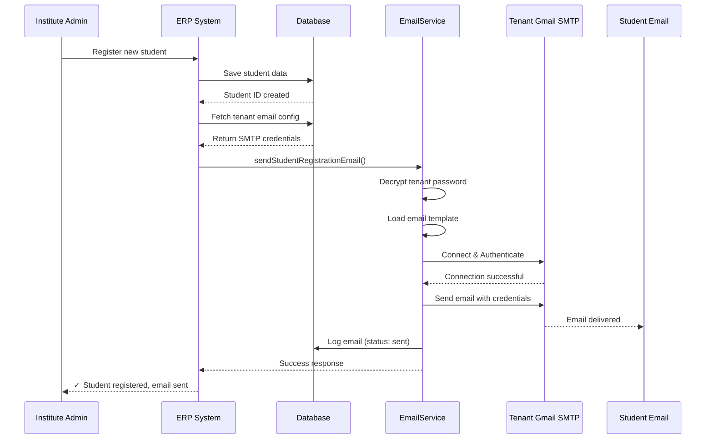
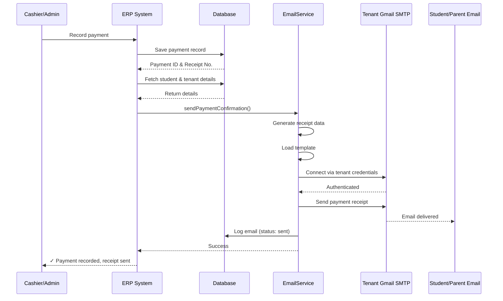
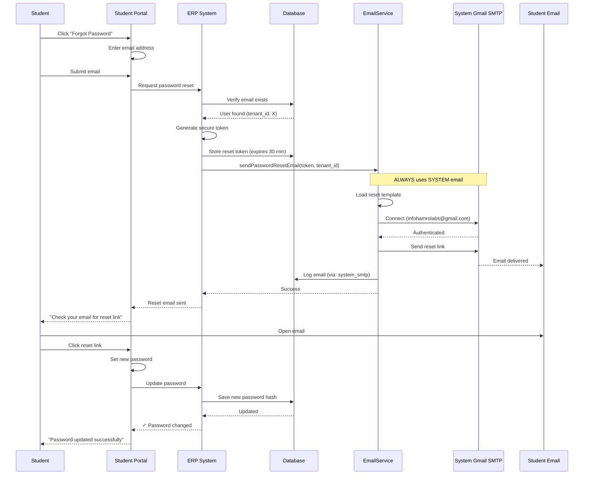
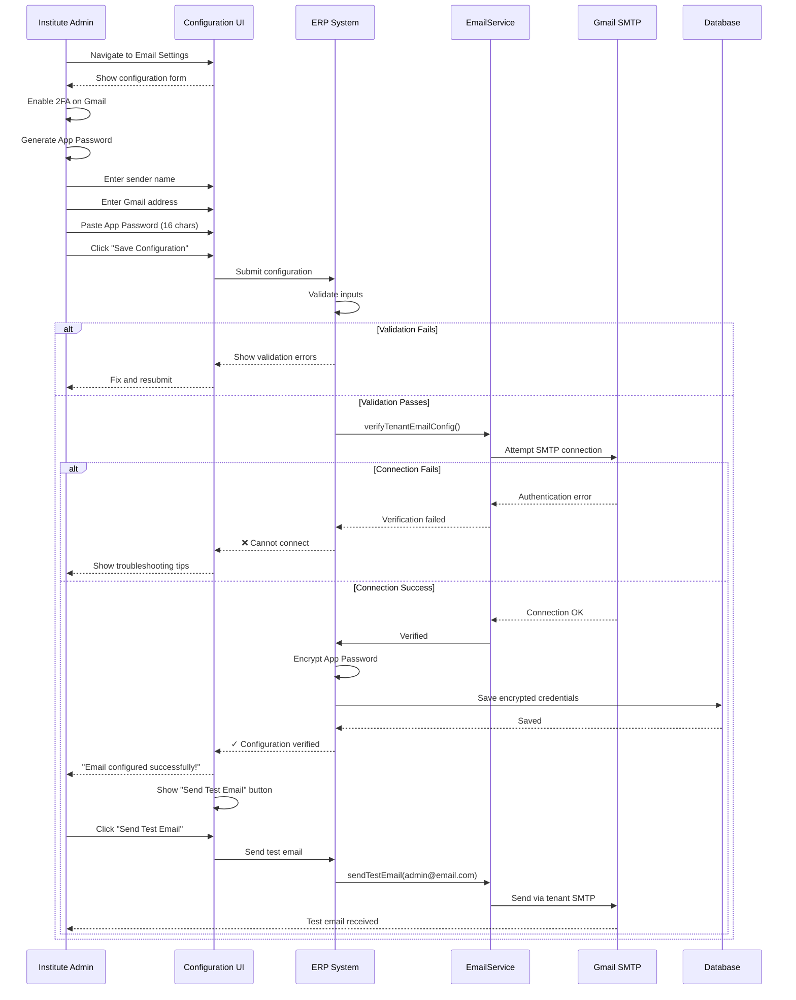
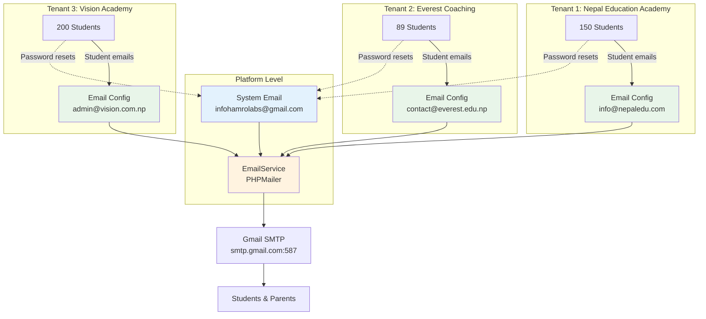
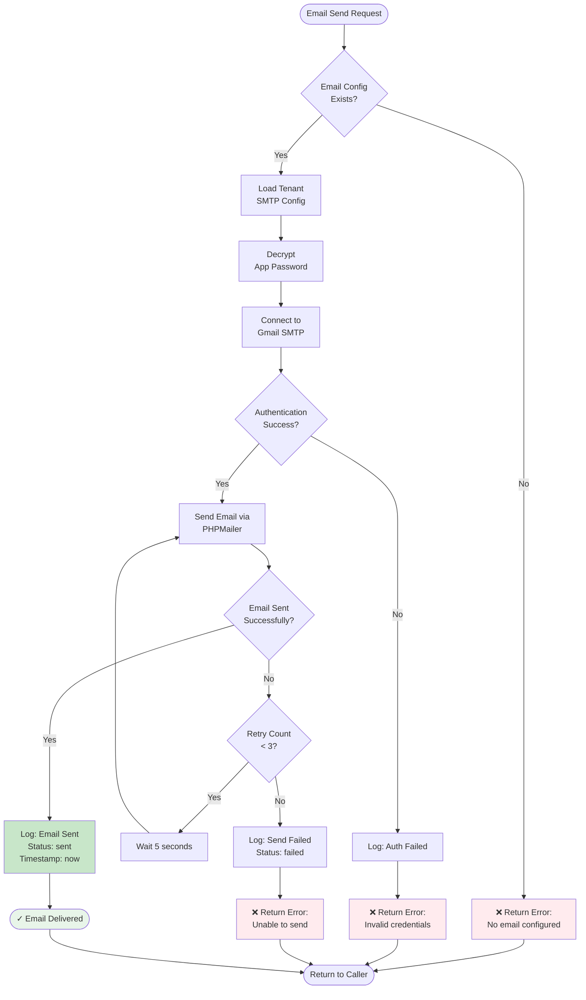

# Multi-Tenant Email System - Technical Documentation
## ERP for Coaching & Loksewa Preparation Centers

**Version:** 1.0  
**Last Updated:** March 14, 2026  
**Prepared For:** Hamro Labs Development Team

---

## Table of Contents

1. [Overview](#overview)
2. [Use Cases & Scenarios](#use-cases--scenarios)
3. [System Architecture](#system-architecture)
4. [Email Flow Diagrams](#email-flow-diagrams)
5. [Technical Specifications](#technical-specifications)
6. [Database Schema](#database-schema)
7. [UI/UX Design](#uiux-design)
8. [Implementation Guide](#implementation-guide)
9. [Security Considerations](#security-considerations)
10. [Testing & Validation](#testing--validation)
11. [Troubleshooting](#troubleshooting)

---

## Overview

### Purpose
This document outlines the email notification system for a multi-tenant SaaS ERP platform designed for coaching institutes and Loksewa preparation centers in Nepal. The system manages two types of email communications:

1. **Tenant-specific emails** - Sent from each institute's Gmail account
2. **System-level emails** - Sent from the platform (Hamro Labs) for security operations

### Key Features
- ✅ Multi-tenant email isolation
- ✅ Gmail App Password integration (2FA compliant)
- ✅ Automated student notifications
- ✅ Centralized password reset system
- ✅ Email delivery tracking and logging
- ✅ Simple configuration interface
- ✅ Secure credential storage

---

## Use Cases & Scenarios

### Scenario 1: New Institute Onboarding

**Story:**  
*"Nepal Education Academy" is a coaching center in Kathmandu that just subscribed to our ERP platform. They have a Gmail account `info@nepaleducationacademy.com` that they use for all their communications.*

**User Journey:**
1. Institute admin logs into the ERP dashboard
2. Navigates to **Settings → Email Configuration**
3. Sees a simple form asking for:
   - Sender Name (e.g., "Nepal Education Academy")
   - Gmail Address (e.g., info@nepaleducationacademy.com)
   - Gmail App Password (16-character code)
4. System validates the credentials
5. From now on, all student-related emails are sent from their Gmail
6. Password resets still come from Hamro Labs system email

**Benefits:**
- Students receive emails from their institute (builds trust)
- Institute maintains brand identity
- Professional communication

---

### Scenario 2: Student Registration

**Story:**  
*Ram Kumar Sharma enrolls in "Loksewa Group C Preparation" at Nepal Education Academy. The admin creates his account.*

**What Happens:**

```
Student Registration Flow:
1. Admin enters student details in ERP
2. System creates student account
3. System generates temporary credentials
4. Email sent via institute's Gmail:
   - From: Nepal Education Academy <info@nepaleducationacademy.com>
   - To: ram.sharma@gmail.com
   - Subject: "Welcome to Nepal Education Academy"
   - Content: Login credentials, course details, portal link
5. Student receives email, logs in, changes password
```

**Business Value:**
- Immediate access for students
- Professional onboarding experience
- Reduced admin workload

---

### Scenario 3: Payment Confirmation

**Story:**  
*Ram pays Rs. 5,000 for his course fee. The cashier marks the payment as received in the system.*

**What Happens:**

```
Payment Processing Flow:
1. Cashier records payment in ERP
2. System generates receipt number
3. Email sent via institute's Gmail:
   - Receipt PDF attached
   - Payment details
   - Course enrollment confirmation
4. Parent/Student receives confirmation
5. Payment logged in database
```

**Business Value:**
- Instant payment confirmation
- Professional receipts
- Parent transparency
- Reduced manual follow-ups

---

### Scenario 4: Student Forgets Password

**Story:**  
*Sita Devi, a student, forgets her password and clicks "Forgot Password" on the login page.*

**What Happens:**

```
Password Reset Flow:
1. Student enters email address
2. System generates secure reset token
3. Email sent via SYSTEM email (infohamrolabs@gmail.com):
   - From: Hamro Labs Support
   - Subject: "Password Reset Request"
   - Content: Secure reset link (expires in 30 min)
4. Student clicks link
5. Student sets new password
6. System logs password change
```

**Why System Email?**
- Security: Consistent sender for all password resets across all tenants
- Trust: Users recognize password resets come from the platform
- Reputation: Institute email won't be marked spam if reset emails flagged
- Compliance: Separation of security operations from business operations

---

### Scenario 5: Multiple Institutes Using Platform

**Story:**  
*Three different institutes are using the platform: Nepal Education Academy (Kathmandu), Everest Coaching (Pokhara), and Vision Academy (Lalitpur). Each has their own students.*

**What Happens:**

```
Multi-Tenant Isolation:
┌──────────────────────────────────────────────────┐
│ Nepal Education Academy (Tenant ID: 1)          │
│ Email: info@nepaleducationacademy.com           │
│ Students: 150                                    │
│ Emails sent today: 23 (registrations, payments) │
└──────────────────────────────────────────────────┘

┌──────────────────────────────────────────────────┐
│ Everest Coaching (Tenant ID: 2)                 │
│ Email: contact@everestcoaching.edu.np           │
│ Students: 89                                     │
│ Emails sent today: 12 (registrations, payments) │
└──────────────────────────────────────────────────┘

┌──────────────────────────────────────────────────┐
│ Vision Academy (Tenant ID: 3)                   │
│ Email: admin@visionacademy.com.np               │
│ Students: 200                                    │
│ Emails sent today: 45 (registrations, payments) │
└──────────────────────────────────────────────────┘

ALL Password Resets → infohamrolabs@gmail.com
```

**Benefits:**
- Complete data isolation
- Each institute maintains brand identity
- Centralized security operations
- Scalable architecture

---

### Scenario 6: Email Configuration Error

**Story:**  
*An institute admin enters the wrong Gmail App Password while setting up their email.*

**What Happens:**

```
Error Handling Flow:
1. Admin submits email configuration
2. System attempts to connect to Gmail SMTP
3. Authentication fails
4. System shows clear error message:
   "❌ Unable to connect to Gmail. Please check:
   - Your Gmail address is correct
   - 2FA is enabled on your Gmail account
   - App Password is valid (16 characters)
   - App Password is for 'Mail' not 'Other'"
5. Admin corrects the issue
6. System verifies connection
7. ✅ Configuration saved successfully
```

**User Experience:**
- Clear error messages in Nepali/English
- Step-by-step troubleshooting guide
- Live validation feedback
- Prevents configuration errors

---

## System Architecture

### High-Level Architecture

```
┌─────────────────────────────────────────────────────────┐
│                    CLIENT LAYER                         │
│  (Institute Admin Dashboard + Student Portal)          │
└────────────────────┬────────────────────────────────────┘
                     │
                     │ HTTPS
                     │
┌────────────────────▼────────────────────────────────────┐
│               APPLICATION LAYER (PHP)                    │
│  ┌──────────────┐  ┌──────────────┐  ┌──────────────┐ │
│  │   Student    │  │   Payment    │  │    Email     │ │
│  │ Management   │  │ Management   │  │Configuration │ │
│  └──────┬───────┘  └──────┬───────┘  └──────┬───────┘ │
│         │                  │                  │          │
│         └──────────────────┼──────────────────┘          │
│                            │                             │
│                  ┌─────────▼─────────┐                  │
│                  │  EmailService     │                  │
│                  │  (PHPMailer)      │                  │
│                  └─────────┬─────────┘                  │
└────────────────────────────┼──────────────────────────────┘
                             │
                  ┌──────────┴──────────┐
                  │                     │
         ┌────────▼────────┐   ┌────────▼────────┐
         │  Tenant SMTP    │   │  System SMTP    │
         │  (Institute's   │   │  (Hamro Labs)   │
         │   Gmail)        │   │                 │
         └────────┬────────┘   └────────┬────────┘
                  │                     │
                  │                     │
         ┌────────▼────────┐   ┌────────▼────────┐
         │  Gmail SMTP     │   │  Gmail SMTP     │
         │  smtp.gmail.com │   │  smtp.gmail.com │
         └────────┬────────┘   └────────┬────────┘
                  │                     │
                  └──────────┬──────────┘
                             │
                    ┌────────▼────────┐
                    │   RECIPIENTS    │
                    │  (Students,     │
                    │   Parents)      │
                    └─────────────────┘
```

### Email Routing Logic

```
┌─────────────────────────────────────────────────┐
│         Email Send Request Received             │
└────────────────┬────────────────────────────────┘
                 │
                 ▼
         ┌───────────────┐
         │ What type of  │
         │ email is it?  │
         └───┬───────┬───┘
             │       │
     ┌───────┘       └────────┐
     │                        │
     ▼                        ▼
┌─────────────┐      ┌─────────────────┐
│ Password    │      │ Student Related │
│ Reset       │      │ (Registration,  │
│ Email       │      │ Payment, etc.)  │
└─────┬───────┘      └────────┬────────┘
      │                       │
      │                       │
      ▼                       ▼
┌──────────────┐      ┌──────────────────┐
│ Use SYSTEM   │      │ Use TENANT SMTP  │
│ SMTP         │      │ (Institute's     │
│ (infohamro   │      │  Gmail)          │
│ labs@gmail)  │      │                  │
└──────┬───────┘      └────────┬─────────┘
       │                       │
       └───────────┬───────────┘
                   │
                   ▼
            ┌──────────────┐
            │ Send via     │
            │ PHPMailer    │
            └──────┬───────┘
                   │
                   ▼
            ┌──────────────┐
            │ Log to       │
            │ email_logs   │
            │ table        │
            └──────────────┘
```

---

## Email Flow Diagrams

### 1. Student Registration Email Flow



### 2. Payment Confirmation Email Flow



### 3. Password Reset Email Flow



### 4. Email Configuration Setup Flow



### 5. Multi-Tenant Email Isolation



### 6. Error Handling & Retry Logic



---

## Technical Specifications

### Technology Stack

| Component | Technology | Version | Purpose |
|-----------|-----------|---------|---------|
| **Backend** | PHP | 8.1+ | Server-side logic |
| **Email Library** | PHPMailer | 6.8+ | SMTP email handling |
| **Database** | MySQL | 8.0+ | Data persistence |
| **Framework** | Laravel (Optional) | 10.x | MVC structure |
| **Encryption** | OpenSSL | - | Password encryption |
| **SMTP Protocol** | TLS/STARTTLS | 1.2+ | Secure email transmission |
| **Frontend** | HTML/CSS/JS | - | Configuration UI |

### Email Types & Routing

| Email Type | Sender | Use Case | Priority |
|------------|--------|----------|----------|
| **Student Registration** | Tenant SMTP | New account creation | High |
| **Payment Confirmation** | Tenant SMTP | Payment receipts | High |
| **Course Enrollment** | Tenant SMTP | Course registration | Medium |
| **Class Schedule** | Tenant SMTP | Schedule updates | Medium |
| **Results Notification** | Tenant SMTP | Exam results | High |
| **General Announcements** | Tenant SMTP | Institute news | Low |
| **Password Reset** | System SMTP | Security operation | Critical |
| **Account Verification** | System SMTP | Email verification | High |
| **2FA Codes** | System SMTP | Login security | Critical |

### SMTP Configuration

#### Gmail SMTP Settings (Used for Both Tenant & System)

```
Host: smtp.gmail.com
Port: 587
Encryption: STARTTLS (TLS)
Authentication: Required
Username: [Gmail Address]
Password: [16-character App Password]
Charset: UTF-8
```

### Gmail Sending Limits

| Account Type | Limit | Notes |
|--------------|-------|-------|
| **Free Gmail** | 500 emails/day | Per account |
| **Google Workspace** | 2,000 emails/day | Per account |
| **Recommendation** | Monitor usage | Alert at 80% |

**Important:** Each tenant account has its own 500/2000 email quota. System email also has separate quota.

---

## Database Schema

### Tables Overview

```sql
-- Main tables for email system
1. tenants                    -- Institute information
2. tenant_email_configs       -- SMTP credentials per tenant
3. email_logs                 -- Email delivery tracking
4. email_templates            -- Reusable email templates
```

### Detailed Schema

```sql
-- ============================================
-- TENANTS TABLE
-- ============================================
CREATE TABLE tenants (
    id INT UNSIGNED PRIMARY KEY AUTO_INCREMENT,
    name VARCHAR(255) NOT NULL COMMENT 'Institute name',
    subdomain VARCHAR(100) UNIQUE COMMENT 'Subdomain for multi-tenancy',
    contact_email VARCHAR(255) NOT NULL,
    phone VARCHAR(20),
    address TEXT,
    status ENUM('active', 'suspended', 'trial', 'expired') DEFAULT 'trial',
    subscription_plan ENUM('free', 'basic', 'premium', 'enterprise') DEFAULT 'free',
    subscription_expires_at DATETIME NULL,
    created_at TIMESTAMP DEFAULT CURRENT_TIMESTAMP,
    updated_at TIMESTAMP DEFAULT CURRENT_TIMESTAMP ON UPDATE CURRENT_TIMESTAMP,
    
    INDEX idx_status (status),
    INDEX idx_subdomain (subdomain)
) ENGINE=InnoDB DEFAULT CHARSET=utf8mb4 COLLATE=utf8mb4_unicode_ci;

-- ============================================
-- TENANT EMAIL CONFIGURATIONS TABLE
-- ============================================
CREATE TABLE tenant_email_configs (
    id INT UNSIGNED PRIMARY KEY AUTO_INCREMENT,
    tenant_id INT UNSIGNED NOT NULL,
    
    -- SMTP Configuration
    email_type ENUM('gmail', 'custom_smtp') DEFAULT 'gmail',
    smtp_host VARCHAR(255) DEFAULT 'smtp.gmail.com',
    smtp_port INT DEFAULT 587,
    smtp_encryption ENUM('tls', 'ssl', 'none') DEFAULT 'tls',
    
    -- Credentials (Gmail)
    smtp_username VARCHAR(255) NOT NULL COMMENT 'Gmail address',
    smtp_password TEXT NOT NULL COMMENT 'Encrypted App Password',
    
    -- Sender Information
    from_email VARCHAR(255) NOT NULL COMMENT 'Display email',
    from_name VARCHAR(255) NOT NULL COMMENT 'Display name',
    
    -- Verification Status
    is_verified BOOLEAN DEFAULT FALSE COMMENT 'SMTP connection verified',
    is_active BOOLEAN DEFAULT TRUE COMMENT 'Currently in use',
    last_verified_at TIMESTAMP NULL COMMENT 'Last successful test',
    verification_error TEXT NULL COMMENT 'Last error message',
    
    -- Usage Tracking
    daily_email_count INT DEFAULT 0 COMMENT 'Emails sent today',
    daily_limit INT DEFAULT 500 COMMENT 'Gmail free account limit',
    last_reset_date DATE NULL COMMENT 'Last daily counter reset',
    
    -- Metadata
    created_by INT UNSIGNED NULL COMMENT 'Admin user ID',
    created_at TIMESTAMP DEFAULT CURRENT_TIMESTAMP,
    updated_at TIMESTAMP DEFAULT CURRENT_TIMESTAMP ON UPDATE CURRENT_TIMESTAMP,
    
    FOREIGN KEY (tenant_id) REFERENCES tenants(id) ON DELETE CASCADE,
    UNIQUE KEY unique_tenant_active (tenant_id, is_active),
    INDEX idx_verification (is_verified, is_active),
    INDEX idx_daily_usage (tenant_id, last_reset_date)
) ENGINE=InnoDB DEFAULT CHARSET=utf8mb4 COLLATE=utf8mb4_unicode_ci;

-- ============================================
-- EMAIL LOGS TABLE
-- ============================================
CREATE TABLE email_logs (
    id BIGINT UNSIGNED PRIMARY KEY AUTO_INCREMENT,
    tenant_id INT UNSIGNED NULL COMMENT 'NULL for system emails',
    
    -- Email Details
    email_type ENUM(
        'student_registration',
        'payment_confirmation',
        'course_enrollment',
        'schedule_notification',
        'results_notification',
        'password_reset',
        'account_verification',
        'general_notification'
    ) NOT NULL,
    
    -- Recipients
    to_email VARCHAR(255) NOT NULL,
    cc_emails TEXT NULL COMMENT 'Comma-separated',
    bcc_emails TEXT NULL COMMENT 'Comma-separated',
    
    -- Content
    subject VARCHAR(500) NOT NULL,
    body_preview TEXT NULL COMMENT 'First 200 chars',
    has_attachment BOOLEAN DEFAULT FALSE,
    
    -- Delivery Status
    status ENUM('queued', 'sent', 'failed', 'bounced') DEFAULT 'queued',
    sent_via ENUM('tenant_smtp', 'system_smtp') NOT NULL,
    
    -- Error Tracking
    error_message TEXT NULL,
    retry_count INT DEFAULT 0,
    last_retry_at TIMESTAMP NULL,
    
    -- Timestamps
    queued_at TIMESTAMP DEFAULT CURRENT_TIMESTAMP,
    sent_at TIMESTAMP NULL,
    opened_at TIMESTAMP NULL COMMENT 'If tracking enabled',
    clicked_at TIMESTAMP NULL COMMENT 'If tracking enabled',
    
    FOREIGN KEY (tenant_id) REFERENCES tenants(id) ON DELETE SET NULL,
    INDEX idx_tenant_status (tenant_id, status),
    INDEX idx_email_type (email_type, status),
    INDEX idx_sent_at (sent_at),
    INDEX idx_to_email (to_email),
    INDEX idx_status_retry (status, retry_count)
) ENGINE=InnoDB DEFAULT CHARSET=utf8mb4 COLLATE=utf8mb4_unicode_ci;

-- ============================================
-- EMAIL TEMPLATES TABLE (Optional)
-- ============================================
CREATE TABLE email_templates (
    id INT UNSIGNED PRIMARY KEY AUTO_INCREMENT,
    tenant_id INT UNSIGNED NULL COMMENT 'NULL for system templates',
    
    -- Template Info
    template_key VARCHAR(100) NOT NULL COMMENT 'e.g., student_registration',
    template_name VARCHAR(255) NOT NULL,
    description TEXT NULL,
    
    -- Content
    subject VARCHAR(500) NOT NULL,
    body_html TEXT NOT NULL COMMENT 'HTML template',
    body_text TEXT NULL COMMENT 'Plain text fallback',
    
    -- Variables
    available_variables JSON NULL COMMENT 'List of {{variable}} names',
    
    -- Status
    is_active BOOLEAN DEFAULT TRUE,
    is_default BOOLEAN DEFAULT FALSE COMMENT 'System default template',
    
    -- Metadata
    created_at TIMESTAMP DEFAULT CURRENT_TIMESTAMP,
    updated_at TIMESTAMP DEFAULT CURRENT_TIMESTAMP ON UPDATE CURRENT_TIMESTAMP,
    
    FOREIGN KEY (tenant_id) REFERENCES tenants(id) ON DELETE CASCADE,
    UNIQUE KEY unique_tenant_template (tenant_id, template_key),
    INDEX idx_template_key (template_key, is_active)
) ENGINE=InnoDB DEFAULT CHARSET=utf8mb4 COLLATE=utf8mb4_unicode_ci;

-- ============================================
-- INDEXES FOR PERFORMANCE
-- ============================================

-- Optimize tenant email config lookup
CREATE INDEX idx_tenant_config_lookup 
ON tenant_email_configs(tenant_id, is_active, is_verified);

-- Optimize email log queries by date range
CREATE INDEX idx_email_logs_date_range 
ON email_logs(tenant_id, sent_at, status);

-- Optimize daily usage tracking
CREATE INDEX idx_daily_usage_tracking 
ON tenant_email_configs(tenant_id, last_reset_date, daily_email_count);
```

### Sample Data

```sql
-- Insert system email configuration (for reference)
-- Note: System email is configured via .env, not in database

-- Sample tenant
INSERT INTO tenants (name, subdomain, contact_email, status) VALUES
('Nepal Education Academy', 'nepaledu', 'admin@nepaledu.com', 'active');

-- Sample tenant email configuration
INSERT INTO tenant_email_configs 
(tenant_id, smtp_username, smtp_password, from_email, from_name, is_verified) 
VALUES
(1, 'info@nepaleducationacademy.com', 
 'ENCRYPTED_APP_PASSWORD_HERE', 
 'info@nepaleducationacademy.com', 
 'Nepal Education Academy', 
 TRUE);

-- Sample email log
INSERT INTO email_logs 
(tenant_id, email_type, to_email, subject, status, sent_via, sent_at) 
VALUES
(1, 'student_registration', 'ram.sharma@gmail.com', 
 'Welcome to Nepal Education Academy', 
 'sent', 'tenant_smtp', NOW());
```

---

## UI/UX Design

### Simple Email Configuration Interface

#### Design Principles
- **Minimal Input**: Only ask for essential information
- **Clear Instructions**: Step-by-step guidance in Nepali & English
- **Instant Validation**: Real-time feedback
- **Visual Feedback**: Success/error states
- **Help Resources**: Links to Gmail setup guide

---

### UI Mockup (HTML/CSS)

```html
<!DOCTYPE html>
<html lang="en">
<head>
    <meta charset="UTF-8">
    <meta name="viewport" content="width=device-width, initial-scale=1.0">
    <title>Email Configuration - ERP System</title>
    <style>
        * {
            margin: 0;
            padding: 0;
            box-sizing: border-box;
        }
        
        body {
            font-family: 'Segoe UI', Tahoma, Geneva, Verdana, sans-serif;
            background: #f5f7fa;
            padding: 20px;
        }
        
        .container {
            max-width: 800px;
            margin: 0 auto;
        }
        
        .card {
            background: white;
            border-radius: 12px;
            padding: 30px;
            box-shadow: 0 2px 8px rgba(0,0,0,0.1);
            margin-bottom: 20px;
        }
        
        .header {
            margin-bottom: 30px;
        }
        
        .header h1 {
            color: #2c3e50;
            font-size: 28px;
            margin-bottom: 8px;
        }
        
        .header p {
            color: #7f8c8d;
            font-size: 14px;
        }
        
        .alert {
            padding: 15px 20px;
            border-radius: 8px;
            margin-bottom: 25px;
            display: flex;
            align-items: start;
            gap: 12px;
        }
        
        .alert-info {
            background: #e3f2fd;
            border-left: 4px solid #2196F3;
            color: #1565c0;
        }
        
        .alert-success {
            background: #e8f5e9;
            border-left: 4px solid #4CAF50;
            color: #2e7d32;
        }
        
        .alert-error {
            background: #ffebee;
            border-left: 4px solid #f44336;
            color: #c62828;
        }
        
        .alert-icon {
            font-size: 20px;
            flex-shrink: 0;
        }
        
        .form-group {
            margin-bottom: 25px;
        }
        
        .form-group label {
            display: block;
            margin-bottom: 8px;
            color: #2c3e50;
            font-weight: 600;
            font-size: 14px;
        }
        
        .form-group label .required {
            color: #e74c3c;
        }
        
        .form-group .hint {
            font-size: 13px;
            color: #7f8c8d;
            margin-top: 5px;
            display: block;
        }
        
        .form-control {
            width: 100%;
            padding: 12px 15px;
            border: 2px solid #e0e0e0;
            border-radius: 8px;
            font-size: 14px;
            transition: all 0.3s;
            font-family: inherit;
        }
        
        .form-control:focus {
            outline: none;
            border-color: #2196F3;
            box-shadow: 0 0 0 3px rgba(33, 150, 243, 0.1);
        }
        
        .form-control.error {
            border-color: #f44336;
        }
        
        .form-control.success {
            border-color: #4CAF50;
        }
        
        .input-group {
            position: relative;
        }
        
        .input-icon {
            position: absolute;
            right: 15px;
            top: 50%;
            transform: translateY(-50%);
            color: #7f8c8d;
        }
        
        .input-icon.success {
            color: #4CAF50;
        }
        
        .input-icon.error {
            color: #f44336;
        }
        
        .error-message {
            color: #f44336;
            font-size: 13px;
            margin-top: 5px;
            display: none;
        }
        
        .error-message.show {
            display: block;
        }
        
        .btn {
            padding: 12px 24px;
            border: none;
            border-radius: 8px;
            font-size: 14px;
            font-weight: 600;
            cursor: pointer;
            transition: all 0.3s;
            display: inline-flex;
            align-items: center;
            gap: 8px;
        }
        
        .btn-primary {
            background: #2196F3;
            color: white;
        }
        
        .btn-primary:hover {
            background: #1976D2;
            transform: translateY(-2px);
            box-shadow: 0 4px 12px rgba(33, 150, 243, 0.3);
        }
        
        .btn-secondary {
            background: #f5f7fa;
            color: #2c3e50;
            border: 2px solid #e0e0e0;
        }
        
        .btn-secondary:hover {
            background: #e0e0e0;
        }
        
        .btn:disabled {
            opacity: 0.6;
            cursor: not-allowed;
        }
        
        .btn-group {
            display: flex;
            gap: 12px;
            margin-top: 30px;
        }
        
        .steps {
            background: #f8f9fa;
            padding: 20px;
            border-radius: 8px;
            margin-bottom: 25px;
        }
        
        .steps h3 {
            color: #2c3e50;
            font-size: 16px;
            margin-bottom: 15px;
        }
        
        .steps ol {
            margin-left: 20px;
            color: #555;
        }
        
        .steps li {
            margin-bottom: 10px;
            line-height: 1.6;
        }
        
        .steps code {
            background: #e0e0e0;
            padding: 2px 6px;
            border-radius: 4px;
            font-size: 13px;
            color: #c62828;
        }
        
        .status-badge {
            display: inline-flex;
            align-items: center;
            gap: 6px;
            padding: 6px 12px;
            border-radius: 20px;
            font-size: 13px;
            font-weight: 600;
        }
        
        .status-badge.verified {
            background: #e8f5e9;
            color: #2e7d32;
        }
        
        .status-badge.not-verified {
            background: #fff3e0;
            color: #e65100;
        }
        
        .loading-spinner {
            border: 3px solid #f3f3f3;
            border-top: 3px solid #2196F3;
            border-radius: 50%;
            width: 20px;
            height: 20px;
            animation: spin 1s linear infinite;
        }
        
        @keyframes spin {
            0% { transform: rotate(0deg); }
            100% { transform: rotate(360deg); }
        }
        
        .help-link {
            color: #2196F3;
            text-decoration: none;
            font-size: 13px;
            display: inline-flex;
            align-items: center;
            gap: 4px;
        }
        
        .help-link:hover {
            text-decoration: underline;
        }
    </style>
</head>
<body>
    <div class="container">
        <!-- Header -->
        <div class="card">
            <div class="header">
                <h1>📧 Email Configuration</h1>
                <p>Configure your institute's email for sending notifications to students</p>
            </div>
            
            <!-- Info Alert -->
            <div class="alert alert-info">
                <span class="alert-icon">ℹ️</span>
                <div>
                    <strong>Before you start:</strong> You need to enable 2-Step Verification on your Gmail account and generate an App Password. 
                    <a href="#" class="help-link">
                        Learn how to generate App Password →
                    </a>
                </div>
            </div>
            
            <!-- Setup Steps -->
            <div class="steps">
                <h3>📋 How to get Gmail App Password:</h3>
                <ol>
                    <li>Go to your <strong>Google Account Settings</strong></li>
                    <li>Navigate to <strong>Security → 2-Step Verification</strong></li>
                    <li>Enable 2-Step Verification if not already enabled</li>
                    <li>Go to <strong>Security → App Passwords</strong></li>
                    <li>Select App: <code>Mail</code>, Device: <code>Other (ERP System)</code></li>
                    <li>Click <strong>Generate</strong> and copy the 16-character password</li>
                </ol>
            </div>
        </div>
        
        <!-- Configuration Form -->
        <div class="card">
            <form id="emailConfigForm">
                <!-- Current Status (if already configured) -->
                <div class="form-group" id="currentStatus" style="display: none;">
                    <label>Current Status</label>
                    <div>
                        <span class="status-badge verified">
                            ✓ Email Configured & Verified
                        </span>
                        <p class="hint">Last verified: March 14, 2026 at 10:30 AM</p>
                    </div>
                </div>
                
                <!-- Sender Name -->
                <div class="form-group">
                    <label>
                        Sender Name <span class="required">*</span>
                    </label>
                    <input 
                        type="text" 
                        class="form-control" 
                        id="senderName" 
                        placeholder="e.g., Nepal Education Academy"
                        required
                    />
                    <span class="hint">
                        This name will appear in emails sent to students (e.g., "Nepal Education Academy")
                    </span>
                    <span class="error-message" id="senderNameError">
                        Please enter a sender name
                    </span>
                </div>
                
                <!-- Gmail Address -->
                <div class="form-group">
                    <label>
                        Gmail Address <span class="required">*</span>
                    </label>
                    <div class="input-group">
                        <input 
                            type="email" 
                            class="form-control" 
                            id="gmailAddress" 
                            placeholder="info@yourorganization.com"
                            required
                        />
                        <span class="input-icon" id="emailIcon"></span>
                    </div>
                    <span class="hint">
                        Your Gmail account (can be Gmail or Google Workspace)
                    </span>
                    <span class="error-message" id="gmailError">
                        Please enter a valid Gmail address
                    </span>
                </div>
                
                <!-- App Password -->
                <div class="form-group">
                    <label>
                        Gmail App Password <span class="required">*</span>
                    </label>
                    <div class="input-group">
                        <input 
                            type="password" 
                            class="form-control" 
                            id="appPassword" 
                            placeholder="xxxx xxxx xxxx xxxx"
                            maxlength="19"
                            required
                        />
                        <span class="input-icon" id="passwordIcon"></span>
                    </div>
                    <span class="hint">
                        16-character App Password from Google (spaces will be removed automatically)
                    </span>
                    <span class="error-message" id="passwordError">
                        App Password must be exactly 16 characters
                    </span>
                </div>
                
                <!-- Buttons -->
                <div class="btn-group">
                    <button type="submit" class="btn btn-primary" id="saveBtn">
                        <span>💾 Save Configuration</span>
                    </button>
                    <button type="button" class="btn btn-secondary" id="testBtn" disabled>
                        <span>📨 Send Test Email</span>
                    </button>
                </div>
            </form>
        </div>
        
        <!-- Success Message (Hidden by default) -->
        <div class="card" id="successCard" style="display: none;">
            <div class="alert alert-success">
                <span class="alert-icon">✅</span>
                <div>
                    <strong>Configuration Saved Successfully!</strong><br>
                    Your email configuration has been verified and activated. You can now send test email.
                </div>
            </div>
        </div>
        
        <!-- Error Message (Hidden by default) -->
        <div class="card" id="errorCard" style="display: none;">
            <div class="alert alert-error">
                <span class="alert-icon">❌</span>
                <div>
                    <strong>Configuration Failed</strong><br>
                    <span id="errorDetails">Unable to connect to Gmail. Please check your credentials.</span>
                    <br><br>
                    <strong>Common issues:</strong>
                    <ul style="margin-left: 20px; margin-top: 10px;">
                        <li>2-Step Verification not enabled</li>
                        <li>App Password incorrect or expired</li>
                        <li>Gmail address doesn't match the account</li>
                    </ul>
                </div>
            </div>
        </div>
    </div>
    
    <script>
        // Form elements
        const form = document.getElementById('emailConfigForm');
        const senderName = document.getElementById('senderName');
        const gmailAddress = document.getElementById('gmailAddress');
        const appPassword = document.getElementById('appPassword');
        const saveBtn = document.getElementById('saveBtn');
        const testBtn = document.getElementById('testBtn');
        const successCard = document.getElementById('successCard');
        const errorCard = document.getElementById('errorCard');
        
        // Real-time validation
        gmailAddress.addEventListener('input', function() {
            const emailIcon = document.getElementById('emailIcon');
            const emailRegex = /^[^\s@]+@[^\s@]+\.[^\s@]+$/;
            
            if (emailRegex.test(this.value)) {
                this.classList.remove('error');
                this.classList.add('success');
                emailIcon.textContent = '✓';
                emailIcon.classList.add('success');
            } else {
                this.classList.remove('success');
                emailIcon.textContent = '';
            }
        });
        
        // App Password formatting
        appPassword.addEventListener('input', function() {
            let value = this.value.replace(/\s/g, '');
            const passwordIcon = document.getElementById('passwordIcon');
            
            if (value.length === 16) {
                this.classList.remove('error');
                this.classList.add('success');
                passwordIcon.textContent = '✓';
                passwordIcon.classList.add('success');
            } else {
                this.classList.remove('success');
                passwordIcon.textContent = '';
            }
        });
        
        // Form submission
        form.addEventListener('submit', async function(e) {
            e.preventDefault();
            
            // Hide previous messages
            successCard.style.display = 'none';
            errorCard.style.display = 'none';
            
            // Validate
            let isValid = true;
            
            if (!senderName.value.trim()) {
                document.getElementById('senderNameError').classList.add('show');
                senderName.classList.add('error');
                isValid = false;
            }
            
            if (!gmailAddress.value.trim()) {
                document.getElementById('gmailError').classList.add('show');
                gmailAddress.classList.add('error');
                isValid = false;
            }
            
            const cleanPassword = appPassword.value.replace(/\s/g, '');
            if (cleanPassword.length !== 16) {
                document.getElementById('passwordError').classList.add('show');
                appPassword.classList.add('error');
                isValid = false;
            }
            
            if (!isValid) return;
            
            // Show loading
            saveBtn.disabled = true;
            saveBtn.innerHTML = '<div class="loading-spinner"></div><span>Verifying...</span>';
            
            // Simulate API call
            try {
                // Replace this with actual AJAX call to your backend
                const response = await fetch('/api/email/configure', {
                    method: 'POST',
                    headers: {
                        'Content-Type': 'application/json',
                    },
                    body: JSON.stringify({
                        sender_name: senderName.value,
                        gmail_address: gmailAddress.value,
                        app_password: cleanPassword
                    })
                });
                
                const result = await response.json();
                
                if (result.success) {
                    successCard.style.display = 'block';
                    testBtn.disabled = false;
                    form.reset();
                } else {
                    errorCard.style.display = 'block';
                    document.getElementById('errorDetails').textContent = result.message;
                }
            } catch (error) {
                errorCard.style.display = 'block';
                document.getElementById('errorDetails').textContent = error.message;
            } finally {
                saveBtn.disabled = false;
                saveBtn.innerHTML = '<span>💾 Save Configuration</span>';
            }
        });
        
        // Test email
        testBtn.addEventListener('click', async function() {
            const testEmail = prompt('Enter email address to send test email:');
            if (!testEmail) return;
            
            this.disabled = true;
            this.innerHTML = '<div class="loading-spinner"></div><span>Sending...</span>';
            
            try {
                // Replace with actual API call
                const response = await fetch('/api/email/test', {
                    method: 'POST',
                    headers: {
                        'Content-Type': 'application/json',
                    },
                    body: JSON.stringify({ test_email: testEmail })
                });
                
                const result = await response.json();
                
                if (result.success) {
                    alert('✅ Test email sent successfully! Check ' + testEmail);
                } else {
                    alert('❌ Failed to send test email: ' + result.message);
                }
            } catch (error) {
                alert('❌ Error: ' + error.message);
            } finally {
                this.disabled = false;
                this.innerHTML = '<span>📨 Send Test Email</span>';
            }
        });
    </script>
</body>
</html>
```

---

## Implementation Guide

### Phase 1: Database Setup (Week 1)

```sql
-- Run migration scripts
CREATE DATABASE erp_system CHARACTER SET utf8mb4 COLLATE utf8mb4_unicode_ci;
USE erp_system;

-- Create tables in order
SOURCE /path/to/migrations/001_create_tenants_table.sql;
SOURCE /path/to/migrations/002_create_tenant_email_configs_table.sql;
SOURCE /path/to/migrations/003_create_email_logs_table.sql;
SOURCE /path/to/migrations/004_create_email_templates_table.sql;
```

### Phase 2: Environment Setup (Week 1)

```bash
# Install PHPMailer
composer require phpmailer/phpmailer

# Create .env file
cp .env.example .env
```

**.env Configuration:**

```env
# System Email (Hamro Labs)
SYSTEM_EMAIL=infohamrolabs@gmail.com
SYSTEM_EMAIL_PASSWORD=your_app_password_here
SYSTEM_EMAIL_NAME="Hamro Labs Support"

# Database
DB_HOST=localhost
DB_NAME=erp_system
DB_USER=root
DB_PASS=your_password

# App Settings
APP_KEY=base64:random_32_character_key_here
APP_ENV=production
APP_DEBUG=false

# Email Settings
MAIL_MAILER=smtp
MAIL_HOST=smtp.gmail.com
MAIL_PORT=587
MAIL_ENCRYPTION=tls
MAIL_FROM_ADDRESS=infohamrolabs@gmail.com
MAIL_FROM_NAME="Hamro Labs"
```

### Phase 3: Core Implementation (Week 2-3)

#### File Structure

```
/your-project
├── app/
│   ├── Services/
│   │   └── EmailService.php          # Main email service
│   ├── Models/
│   │   ├── Tenant.php
│   │   ├── TenantEmailConfig.php
│   │   └── EmailLog.php
│   └── Controllers/
│       ├── TenantEmailController.php
│       └── StudentController.php
├── resources/
│   └── email_templates/
│       ├── student_registration.php
│       ├── payment_confirmation.php
│       └── password_reset.php
├── public/
│   └── admin/
│       └── email-config.html           # Configuration UI
├── config/
│   └── mail.php
└── .env
```

### Phase 4: Testing (Week 4)

#### Test Checklist

```
Email Configuration Tests:
☐ Valid Gmail credentials accepted
☐ Invalid credentials rejected
☐ App Password validation (16 chars)
☐ SMTP connection test successful
☐ Configuration saved to database
☐ Password encrypted properly

Student Registration Tests:
☐ Email sent via tenant SMTP
☐ Correct sender name displayed
☐ Student receives login credentials
☐ Email logged in database
☐ Template variables replaced correctly

Payment Confirmation Tests:
☐ Receipt email sent
☐ PDF attachment included
☐ Amount & receipt number correct
☐ Email sent from institute's address

Password Reset Tests:
☐ Reset email sent via SYSTEM email
☐ Token generated correctly
☐ Link expires after 30 minutes
☐ Email sent regardless of tenant
☐ Security email logged separately

Multi-Tenant Tests:
☐ Tenant A emails use Tenant A SMTP
☐ Tenant B emails use Tenant B SMTP
☐ No cross-tenant data leakage
☐ Email logs separated by tenant
☐ Daily limits tracked per tenant

Error Handling Tests:
☐ Failed SMTP shows error message
☐ Retry logic works (3 attempts)
☐ Failures logged to database
☐ Admin notified of failures
☐ Graceful degradation
```

---

## Security Considerations

### 1. Password Storage

```php
// NEVER store App Passwords in plain text
// Always encrypt before storing

// Encryption (when saving)
$encryptedPassword = encrypt($appPassword); // Uses APP_KEY

// Decryption (when using)
$plainPassword = decrypt($encryptedPassword);
```

### 2. Environment Variables

```php
// .env file must be:
// - Outside public directory
// - In .gitignore
// - 600 permissions (owner read/write only)

// Check permissions
chmod 600 .env
```

### 3. SQL Injection Prevention

```php
// ALWAYS use prepared statements
$stmt = $pdo->prepare("INSERT INTO tenant_email_configs 
    (tenant_id, smtp_username, smtp_password) VALUES (?, ?, ?)");
$stmt->execute([$tenantId, $email, $encryptedPassword]);
```

### 4. XSS Prevention

```php
// Always escape output in email templates
echo htmlspecialchars($studentName, ENT_QUOTES, 'UTF-8');
```

### 5. Rate Limiting

```php
// Check daily email limit before sending
if ($config->daily_email_count >= $config->daily_limit) {
    throw new Exception("Daily email limit reached");
}

// Increment counter after sending
$config->increment('daily_email_count');
```

### 6. Access Control

```php
// Only tenant admins can configure email
if (!auth()->user()->hasRole('admin')) {
    abort(403, 'Unauthorized');
}

// Tenant can only access their own config
if ($config->tenant_id !== auth()->user()->tenant_id) {
    abort(403, 'Forbidden');
}
```

---

## Testing & Validation

### Manual Testing Checklist

#### 1. Configuration Setup Test

```
Steps:
1. Login as institute admin
2. Navigate to Email Configuration
3. Enter valid Gmail & App Password
4. Click "Save Configuration"
5. Verify success message appears
6. Check database for encrypted password
7. Click "Send Test Email"
8. Verify test email received

Expected Results:
✓ Configuration saved
✓ Password encrypted in DB
✓ SMTP connection verified
✓ Test email received within 1 minute
```

#### 2. Student Registration Test

```
Steps:
1. Create new student account
2. Fill all required details
3. Submit registration form
4. Check email_logs table
5. Verify student received email

Expected Results:
✓ Email logged with status 'sent'
✓ Email sent from institute's Gmail
✓ Student name & credentials in email
✓ Login link works
✓ Email delivered within 30 seconds
```

#### 3. Password Reset Test

```
Steps:
1. Go to student login page
2. Click "Forgot Password"
3. Enter student email
4. Submit form
5. Check email

Expected Results:
✓ Email sent from infohamrolabs@gmail.com
✓ Reset link received
✓ Link expires after 30 minutes
✓ Can successfully reset password
✓ Email logged as 'system_smtp'
```

### Automated Test Script (PHP)

```php
<?php
// tests/EmailServiceTest.php

use PHPUnit\Framework\TestCase;
use App\Services\EmailService;

class EmailServiceTest extends TestCase
{
    private $emailService;
    
    protected function setUp(): void
    {
        $this->emailService = new EmailService();
    }
    
    public function testTenantEmailConfiguration()
    {
        $tenantId = 1;
        
        // Test configuration verification
        $result = $this->emailService->verifyTenantEmailConfig($tenantId);
        
        $this->assertTrue($result['success']);
        $this->assertEquals('Email configuration verified successfully', 
                           $result['message']);
    }
    
    public function testStudentRegistrationEmail()
    {
        $result = $this->emailService->sendStudentRegistrationEmail(
            1, // tenant ID
            'test@example.com',
            'Test Student',
            ['username' => 'test', 'password' => 'test123']
        );
        
        $this->assertTrue($result);
    }
    
    public function testPasswordResetEmailUseSystemSMTP()
    {
        // Verify password resets always use system email
        $result = $this->emailService->sendPasswordResetEmail(
            'student@example.com',
            'reset_token_123',
            1 // tenant ID
        );
        
        $this->assertTrue($result);
        
        // Check log to verify it used system SMTP
        $log = EmailLog::latest()->first();
        $this->assertEquals('system_smtp', $log->sent_via);
    }
}
```

---

## Troubleshooting

### Common Issues & Solutions

#### Issue 1: "Authentication Failed" Error

**Symptoms:**
```
Error: SMTP Error: Could not authenticate
```

**Causes & Solutions:**

| Cause | Solution |
|-------|----------|
| 2FA not enabled | Enable 2-Step Verification in Google Account |
| Wrong App Password | Generate new App Password |
| Using account password | Must use 16-char App Password, not regular password |
| App Password expired | Delete old password, generate new one |

**Verification Steps:**
```bash
# Test SMTP connection manually
telnet smtp.gmail.com 587

# Expected: 220 smtp.google.com ESMTP
```

---

#### Issue 2: Emails Going to Spam

**Symptoms:**
- Emails delivered but in spam folder
- Low open rates

**Solutions:**

1. **SPF Record** (Ask institute to add)
```
v=spf1 include:_spf.google.com ~all
```

2. **DKIM** (Google Workspace only)
```
Enable in Google Workspace Admin → Apps → Gmail → Authenticate email
```

3. **DMARC Record**
```
v=DMARC1; p=none; rua=mailto:admin@institute.com
```

4. **Content Improvements**
- Avoid spam trigger words
- Include unsubscribe link
- Use plain text version
- Add physical address

---

#### Issue 3: Daily Limit Exceeded

**Symptoms:**
```
Error: Daily sending quota exceeded
```

**Solutions:**

1. **Monitor Usage**
```php
// Check current usage
SELECT tenant_id, daily_email_count, daily_limit, last_reset_date
FROM tenant_email_configs
WHERE daily_email_count > 400; -- Alert at 80%
```

2. **Reset Counter (runs daily at midnight)**
```php
// Cron job: 0 0 * * *
UPDATE tenant_email_configs
SET daily_email_count = 0, last_reset_date = CURDATE()
WHERE last_reset_date < CURDATE();
```

3. **Upgrade Options**
- Move to Google Workspace (2000 emails/day)
- Use dedicated email service (SendGrid, Mailgun)

---

#### Issue 4: Slow Email Delivery

**Symptoms:**
- Emails take 2-5 minutes to arrive
- Timeout errors

**Solutions:**

1. **Queue Implementation**
```php
// Don't send emails synchronously in web requests
// Use job queue instead

// Laravel example
dispatch(new SendEmailJob($emailData));
```

2. **Batch Processing**
```php
// Process 50 emails at a time
$students = Student::where('batch_id', $batchId)
                  ->chunk(50, function($students) {
    foreach($students as $student) {
        // Send email
    }
    sleep(2); // Prevent rate limiting
});
```

---

#### Issue 5: Configuration Not Saving

**Symptoms:**
- Form submits but config not saved
- Database shows old values

**Debug Steps:**

1. **Check Encryption Key**
```php
// .env file
APP_KEY=base64:... // Must be set

// Test encryption
$encrypted = encrypt('test');
$decrypted = decrypt($encrypted);
echo $decrypted; // Should output: test
```

2. **Check Database Permissions**
```sql
-- User needs INSERT, UPDATE permissions
GRANT INSERT, UPDATE ON erp_system.tenant_email_configs TO 'erp_user'@'localhost';
FLUSH PRIVILEGES;
```

3. **Check Form Validation**
```javascript
// Browser console
console.log(formData); // Verify data being sent
```

---

### Error Codes Reference

| Code | Message | Cause | Solution |
|------|---------|-------|----------|
| `SMTP-001` | Connection timeout | Network/firewall | Check port 587 open |
| `SMTP-002` | Authentication failed | Wrong credentials | Verify App Password |
| `SMTP-003` | Daily limit exceeded | Too many emails | Wait 24h or upgrade |
| `SMTP-004` | Invalid recipient | Wrong email format | Validate before sending |
| `DB-001` | Config not found | Tenant not configured | Complete setup first |
| `DB-002` | Encryption failed | No APP_KEY set | Set APP_KEY in .env |
| `VAL-001` | Invalid App Password | Not 16 characters | Check password length |

---

## Monitoring & Maintenance

### Dashboard Metrics to Track

```sql
-- Daily email volume by tenant
SELECT 
    t.name,
    DATE(el.sent_at) as date,
    COUNT(*) as emails_sent,
    SUM(CASE WHEN el.status = 'failed' THEN 1 ELSE 0 END) as failed,
    ROUND(AVG(TIMESTAMPDIFF(SECOND, el.queued_at, el.sent_at)), 2) as avg_delivery_time_sec
FROM email_logs el
JOIN tenants t ON el.tenant_id = t.id
WHERE el.sent_at >= CURDATE() - INTERVAL 7 DAY
GROUP BY t.name, DATE(el.sent_at)
ORDER BY date DESC, emails_sent DESC;

-- Tenants approaching daily limit
SELECT 
    t.name,
    tec.daily_email_count,
    tec.daily_limit,
    ROUND((tec.daily_email_count / tec.daily_limit) * 100, 2) as usage_percent
FROM tenant_email_configs tec
JOIN tenants t ON tec.tenant_id = t.id
WHERE tec.daily_email_count > (tec.daily_limit * 0.8) -- 80% threshold
ORDER BY usage_percent DESC;

-- Failed emails needing attention
SELECT 
    el.id,
    t.name as tenant,
    el.to_email,
    el.subject,
    el.error_message,
    el.retry_count,
    el.queued_at
FROM email_logs el
LEFT JOIN tenants t ON el.tenant_id = t.id
WHERE el.status = 'failed' 
  AND el.retry_count < 3
ORDER BY el.queued_at DESC;
```

### Cron Jobs

```bash
# /etc/cron.d/erp-email

# Reset daily counters at midnight
0 0 * * * php /path/to/erp/artisan email:reset-counters

# Retry failed emails every 15 minutes
*/15 * * * * php /path/to/erp/artisan email:retry-failed

# Clean old logs (older than 90 days)
0 2 * * * php /path/to/erp/artisan email:cleanup-logs --days=90

# Send daily usage reports to admins
0 8 * * * php /path/to/erp/artisan email:usage-report
```

---

## Appendix

### A. Gmail App Password Generation Guide (Nepali)

**Gmail App Password बनाउने तरिका:**

1. आफ्नो Google Account मा जानुहोस्
2. **Security** मा क्लिक गर्नुहोस्
3. **2-Step Verification** सक्षम गर्नुहोस् (यदि पहिले नै सक्षम छैन भने)
4. **App Passwords** मा जानुहोस्
5. **Select app:** Mail चयन गर्नुहोस्
6. **Select device:** Other (Custom name) चयन गर्नुहोस्
7. "ERP System" टाइप गर्नुहोस्
8. **Generate** मा क्लिक गर्नुहोस्
9. १६ अक्षरको password copy गर्नुहोस्
10. यो password ERP system मा राख्नुहोस्

---

### B. Email Template Variables

Available variables for templates:

**Student Registration:**
- `{{student_name}}`
- `{{username}}`
- `{{password}}`
- `{{login_url}}`
- `{{institute_name}}`
- `{{course_name}}`

**Payment Confirmation:**
- `{{student_name}}`
- `{{amount}}`
- `{{receipt_no}}`
- `{{payment_date}}`
- `{{course_name}}`
- `{{institute_name}}`
- `{{payment_method}}`

**Password Reset:**
- `{{reset_url}}`
- `{{expiry_time}}`
- `{{user_email}}`

---

### C. API Endpoints Reference

```
POST /api/email/configure
Body: {
    "sender_name": "Institute Name",
    "gmail_address": "email@gmail.com",
    "app_password": "16charpassword"
}
Response: {
    "success": true,
    "message": "Configuration saved",
    "config_id": 123
}

POST /api/email/verify
Body: { "tenant_id": 1 }
Response: {
    "success": true,
    "message": "Verified"
}

POST /api/email/test
Body: {
    "test_email": "test@example.com"
}
Response: {
    "success": true,
    "message": "Test email sent"
}

GET /api/email/logs?tenant_id=1&limit=50
Response: {
    "logs": [...],
    "total": 150,
    "page": 1
}
```

---

### D. Support Contacts

**For Technical Issues:**
- Email: support@hamrolabs.com
- Phone: +977-XXXX-XXXXXX

**For Gmail Setup Help:**
- Google Support: https://support.google.com

**For Institute Admins:**
- User Manual: `/docs/email-setup-guide.pdf`
- Video Tutorial: `/docs/videos/email-config.mp4`

---

## Version History

| Version | Date | Changes | Author |
|---------|------|---------|--------|
| 1.0 | March 14, 2026 | Initial documentation | Dev Team |

---

**End of Document**


